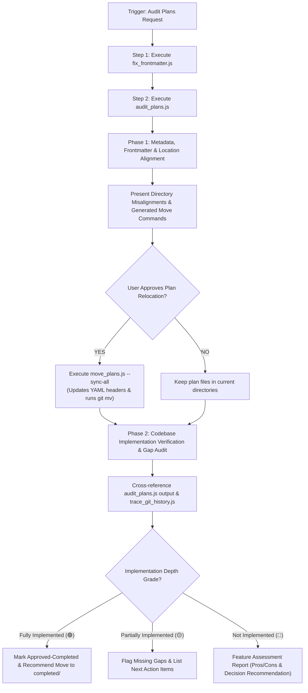

# Plan Auditor & Implementation Gap Skill

This skill conducts a deterministic, token-efficient technical audit of all implementation plans in `.gemini/plan/` by utilizing specialized Node.js helper scripts.

---

## 🛠️ Specialized Script Suite (`.agents/skills/plan-auditor/scripts/`)

| Script | Command Usage | Description |
| :--- | :--- | :--- |
| **`audit_plans.js`** | `node .agents/skills/plan-auditor/scripts/audit_plans.js [--json] [--verbose]` | Scans plans under `.gemini/plan/`, checks `src/` file presence, walkthrough logs, and calculates implementation % per plan. |
| **`move_plans.js`** | `node .agents/skills/plan-auditor/scripts/move_plans.js --plan <file.md> --to <drafted\|approved\|completed> [--dry-run]` <br> `node .agents/skills/plan-auditor/scripts/move_plans.js --sync-all [--dry-run]` | Updates YAML `Status:` tags and executes `git mv` (or file rename) to move plans between `.gemini/plan/` subdirectories. |
| **`fix_frontmatter.js`** | `node .agents/skills/plan-auditor/scripts/fix_frontmatter.js [--dry-run] [--verbose]` | Scans all plan files and injects/normalizes missing YAML frontmatter headers (`Title`, `Date`, `Status`). |
| **`trace_git_history.js`** | `node .agents/skills/plan-auditor/scripts/trace_git_history.js [--json]` | Matches plan titles and file paths against `git log` and `.gemini/memory/git_branches.json` across active/past branches. |

---

## 🛠️ Two-Phase Execution Workflow



---

## 📋 Phase 1 Protocol: Metadata & Location Audit

1. **Normalize Frontmatter**:
   Run `node .agents/skills/plan-auditor/scripts/fix_frontmatter.js` to ensure all `.md` files under `.gemini/plan/` contain standardized YAML headers (`Title`, `Date`, `Status`).

2. **Directory Alignment & Rule Compliance**:
   * *Rule*: The agent updates the `Status:` field in the YAML header, but **MUST NOT** rename or physically move files automatically without explicit user confirmation.
   * *Action*: Run `node .agents/skills/plan-auditor/scripts/move_plans.js --sync-all --dry-run` to preview misaligned plan locations, then present the output to the user.
   * *Execution*: Upon user confirmation, run `node .agents/skills/plan-auditor/scripts/move_plans.js --sync-all` to execute relocations via `git mv`.

---

## 🔍 Phase 2 Protocol: Codebase Verification & Feature Gap Analysis

For plans marked `Approved` or `Proposed`:

1. **Multi-Source Cross-Referencing**:
   * Run `node .agents/skills/plan-auditor/scripts/audit_plans.js --verbose` to inspect target file existence in `src/` and walkthrough logs.
   * Run `node .agents/skills/plan-auditor/scripts/trace_git_history.js` to verify past commit traces or branch activity.

2. **3-Tier Implementation Depth Grading**:

   * 🟢 **Fully Implemented**:
     - Code, schemas, and components match plan specifications; walkthrough or commit trace confirmed.
     - Execute `node .agents/skills/plan-auditor/scripts/move_plans.js --plan <file.md> --to completed`.

   * 🟡 **Partially Implemented**:
     - Foundation or partial components exist in `src/`, but key handlers, hooks, or test suites are missing.
     - Detail existing components vs. missing files, and outline concrete next steps to complete implementation.

   * 🔴 **Not Implemented**:
     - Zero code changes, commits, or walkthrough traces found in the codebase.
     - Provide a **Feature Assessment Report**:
       - 📝 **Planned Feature Scope**: Brief summary of what was proposed.
       - ⚡ **Pros & Value Impact**: Architectural advantages, performance gains, end-user utility.
       - ⚠️ **Cons & Technical Risks**: Added maintenance overhead, structural complexity, potential tech debt.
       - 💡 **Strategic Recommendation**: *Implement Now*, *Keep in Backlog*, or *Deprecate & Prune*.

---

## 📄 Standard Audit Summary Report

Output a clean Markdown report summarizing findings:

```markdown
# 📊 Implementation Plan Audit Report

**Audit Date**: `YYYY-MM-DD`  
**Total Plans Audited**: `[Count]`

---

## 🗂️ 1. Directory & Frontmatter Alignment (Phase 1)

| Plan File | Current Location | Frontmatter Status | Target Directory | Alignment Action |
| :--- | :--- | :--- | :--- | :--- |
| `[plan-name.md]` | `.gemini/plan/drafted/` | `Approved` | `.gemini/plan/approved/` | 🟡 Move Needed |

---

## 🔍 2. Codebase Implementation & Gap Audit (Phase 2)

### 🟢 Fully Implemented Plans
* **`[plan-name.md]`**: All target files verified in `src/` and walkthrough recorded. Ready to move to `completed/`.

### 🟡 Partially Implemented Plans
* **`[plan-name.md]`**: 
  * ✅ Existing: `src/features/...`
  * ❌ Missing: `src/hooks/...`

### 🔴 Unimplemented Plans Analysis

#### 📄 `[unimplemented-plan-name.md]`
* **Planned Feature**: [Brief summary]
* **Pros & Utility**: [Architectural & user benefits]
* **Cons & Overhead**: [Risks or complexity]
* **Strategic Recommendation**: [Implement Now / Backlog / Prune]

---

## 🛠️ Recommended Shell Commands for File Movement

```powershell
node .agents/skills/plan-auditor/scripts/move_plans.js --sync-all
```
```
