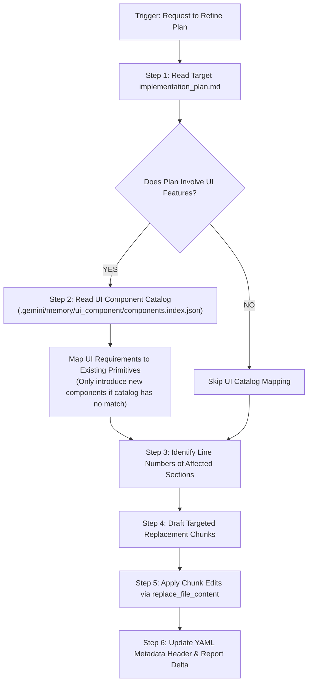

# Plan Refiner & Incremental Updater Skill

This skill performs non-destructive, surgical updates to an existing `implementation_plan.md` document. It incorporates new user feedback or design adjustments while strictly preserving plan history, completed milestones, and untouched sections.

---

## 🛠️ Core Principles & Enforced Rules

### 1. 🚨 Zero Full-File Overwrites (Targeted Chunk Edits Only)
- Never use full-file overwrite calls to rewrite `implementation_plan.md` from scratch.
- Use `replace_file_content` or `multi_replace_file_content` to target only the specific line ranges or sections being modified.

### 2. 🧩 Mandatory UI Component Registry Check
If the implementation plan touches **any UI feature, component, screen, or form layout**:
1. Read `.gemini/memory/ui_component/components.index.json` first.
2. **Prioritize Pre-existing Primitives**: Map layout elements directly to existing components (`Button`, `TextInput`, `KpiCard`, `Badge`, `Card`, `LowDensityCard`, `ConfirmModal`, `MoneyTransactionForm`).
3. **New Components Only as Fallback**: Suggest creating a new component **only** if no suitable primitive exists in the catalog. Explicitly detail the new component's props contract and file location.

### 3. 📐 Infrastructure & Platform Rules Compliance
Ensure all refined sections comply with `.agents/rules/plan-drafting-rule.md`:
- **Rule N1**: Positional signatures with JSDoc `@param` and `@returns` types.
- **Rule N2**: Base knowledge traceability (schemas, files, runbooks).
- **Rule N3**: Fact vs. Assumption boundary declaration.
- **Rule N4**: GAS execution boundary & in-memory batch operations.
- **Rule N5**: Performance benchmark time targets (< 300 ms).
- **Rule N6**: Legacy maintenance isolation caution blocks.

---

## 🛠️ Step-by-Step Refinement Protocol

### Execution Steps:

1. **Inspect Target Document**:
   Read `implementation_plan.md` using `view_file` to note section headers, line numbers, and anchors.

2. **Catalog Audit (If UI Feature)**:
   Read `[components.index.json](file:///e:/NAST/Dazzling/ERP%20System/dazzling-erp-admin/.gemini/memory/ui_component/components.index.json)` and verify component mappings in Section 3 of the plan.

3. **Execute Targeted Replacement**:
   Invoke `replace_file_content` with precise `StartLine`, `EndLine`, `TargetContent`, and `ReplacementContent` parameters.

4. **Summarize Delta**:
   Output a brief summary highlighting:
   - ✏️ **Modified Sections**: (Specific line ranges updated).
   - ➕ **Added Elements**: (New requirements integrated).
   - 🔒 **Preserved Sections**: (Untouched plan sections).
