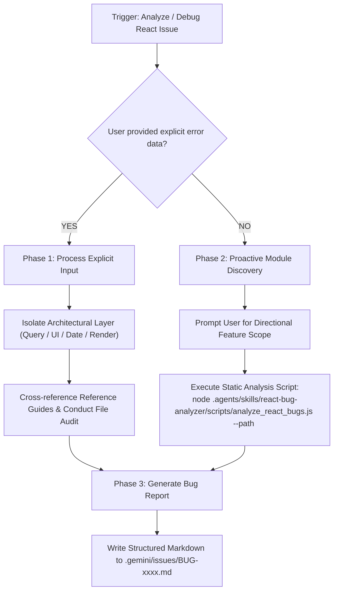

# React Bug Analyzer & Diagnostic Flow

This skill governs the agent's decision-making flow, input validation, proactive problem-seeking behaviors, and integration with project component memory for React-specific diagnostic tasks.

---

## 📋 Skill Overview
* **Role Context:** Senior React Architecture Specialist (React 18/19, TanStack Query, Atomic UI v2)
* **Primary Objective:** Diagnose or discover React bugs, scope context to targeted feature modules, and output structured `React Bug Reports` under `.gemini/issues/` conforming to `.agents/react-issue-format.md`.

---

## 🛠️ Specialized Script & Reference Tools

| Tool / File | Location / Command | Purpose |
| :--- | :--- | :--- |
| **`analyze_react_bugs.js`** | `node .agents/skills/react-bug-analyzer/scripts/analyze_react_bugs.js [--path <dir>] [--json] [--verbose]` | Static analysis engine for detecting query key anomalies, missing `cacheHelper` calls, raw inputs, and date parsing bugs. |
| **`tanstack_query_cache_architecture_guide.md`** | `[tanstack_query_cache_architecture_guide.md](file:///e:/NAST/Dazzling/ERP%20System/dazzling-erp-admin/.agents/skills/react-bug-analyzer/resources/tanstack_query_cache_architecture_guide.md)` | Reference rules for `queryKeys.js`, `cacheHelper.js`, key depth control, and filtering decoupling. |
| **`react-issue-format.md`** | `[react-issue-format.md](file:///e:/NAST/Dazzling/ERP%20System/dazzling-erp-admin/.agents/react-issue-format.md)` | Reference YAML frontmatter and section template for bug report artifacts. |

---

## 🚦 Step-by-Step Diagnostic Protocol

---

## 🔍 Diagnostic Rule Audit Dimensions

### 1. TanStack Query (React Query) & Cache Architecture Audit
* **Query Key Factory Compliance**: Verify query keys are built via `queryKeys.js` (no raw string arrays `['teacher', id]`).
* **Cache Helper Integration**: Verify `use*Query` hooks wrap responses via `resolveList`, `resolveRecord`, `getCachedList`, or `getCachedRecord`.
* **Query Key Granularity & Depth**: Verify keys do not over-segment child entities (`['batches', 'tests', batchId, testId]`). Single item details must be derived via `select: (list) => list.find(...)`.
* **UI Filter Decoupling**: Verify ephemeral UI filters are excluded from query key parameters. Filtering must be performed inside `select` via `queryEngine.js` (`aq(data).filter(...)`).

### 2. UI Token Compliance & Zero-New-UI-Components Policy
* Verify forms and layouts use atomic V2 primitives (`FormField`, `TextInput`, `SelectInput`, `Button`, `KpiCard`, `Badge`).
* Detect raw HTML elements (`<input>`, `<select>`, `<button>`) outside `src/components/ui/`.

### 3. Rendering Performance & Key Hygiene
* Verify array `.map(...)` calls return JSX elements with unique, stable `key` props (not array index `key={idx}`).
* Detect un-memoized array filtering/sorting in render bodies.

### 4. Date Parsing & Timezone Safety
* Verify date operations use `date-fns` (`parseISO`, `format`, `isBefore`) instead of native `new Date("...")` string parsing.

---

## 📄 Output Schema & Issue Registration

Save all reports to `.gemini/issues/` using naming convention:
`<TYPE>-<FOUR_DIGIT_ID>-<kebab-case-description>.md` (e.g. `BUG-0004-query-key-filter-miss.md`).
