# 📊 Student Views Architectural & Optimization Report

> **Target Branch**: `refactor/student-views-optimization`  
> **Reference Knowledge Graph**: `[student_data_profile_architecture.md](file:///e:/NAST/Dazzling/ERP%20System/dazzling-erp-admin/.gemini/memory/K-Graphs/student_data_profile_architecture.md)`  
> **Recipient Context**: Prepared for Agentic Refactoring & Dynamic Data Sync  

---

##  EXECUTIVE SUMMARY

This report provides a structural, component-level analysis of the **Student List View** and **Student Detailed View** (Profile Subsystem). Derived directly from the newly constructed Knowledge Graph, this document audits static data fallbacks, maps component hierarchies, identifies schema hydration boundaries, and outlines the precise refactoring blueprint required for the `refactor/student-views-optimization` feature branch.

---

## 🏛️ K-GRAPH COMPONENT INDEX & SUBSYSTEM HIERARCHY

```mermaid
graph TD
    %% Root Navigation
    AppRoutes["AppRoutes.jsx (/admin/students)"] --> StudentsPage["Students.jsx (List View Controller)"]
    AppRoutes --> StudentProfilePage["StudentProfile.jsx (Detail View Controller)"]

    %% List View Tree
    subgraph List_View_Subsystem["Student List View Subsystem"]
        StudentsPage --> DataTable["DataTable.jsx"]
        StudentsPage --> StudentsMobileView["StudentsMobileView.jsx"]
        DataTable --> createStudentColumns["studentSchema.jsx (createStudentColumns)"]
        StudentsMobileView --> StudentCard_Low["StudentCard.jsx (density='low')"]
        DataTable --> StudentCard_Med["StudentCard.jsx (density='medium')"]
        StudentCard_Low --> LowDensityCard["LowDensityCard.jsx"]
    end

    %% Detail View Tree
    subgraph Detail_View_Subsystem["Student Profile Detail View Subsystem"]
        StudentProfilePage --> ProfileHeader["ProfileHeader.jsx (Desktop Banner)"]
        StudentProfilePage --> ProfileHero["ProfileHero.jsx (Mobile 3-Tier Hero)"]
        StudentProfilePage --> PersonalDetails["PersonalDetails.jsx"]
        StudentProfilePage --> GuardianInfo["GuardianInfo.jsx"]
        StudentProfilePage --> AcademicBackground["AcademicBackground.jsx"]
        StudentProfilePage --> EnrollmentDetails["EnrollmentDetails.jsx"]
        StudentProfilePage --> ProfileSidebar["ProfileSidebar.jsx"]
        StudentProfilePage --> AttendanceHeatmap["AttendanceHeatmap.jsx"]
        StudentProfilePage --> StudentFeeTab["StudentFeeTab.jsx"]

        StudentFeeTab --> FeeAccountCard["fee/FeeAccountCard.jsx"]
        FeeAccountCard --> InstallmentStepperTimeline["fee/InstallmentStepperTimeline.jsx"]
        FeeAccountCard --> InstallmentDetailPanel["fee/InstallmentDetailPanel.jsx"]
        InstallmentDetailPanel --> PaymentReceiptCard["fee/PaymentReceiptCard.jsx"]
    end

    %% Data Hydration Layer
    subgraph Data_Layer["React Query & Hydration Layer"]
        StudentsPage --> useStudentsQuery["useStudentsQuery()"]
        StudentProfilePage --> useStudentById["useStudentById(id)"]
        StudentFeeTab --> useEnrollmentQueries["useEnrollmentsQuery()"]
        useStudentById --> studentApi["student.api.js"]
    end
```

---

## 🚨 STATIC DATA & HARDCODED FALLBACK AUDIT

The following table documents all static/mock data points currently embedded in Student Views that **MUST** be eliminated and replaced with dynamic schema properties.

| File Location | Component / Line | Hardcoded / Static Data Item | Required Dynamic Schema Field |
| :--- | :--- | :--- | :--- |
| `StudentCard.jsx` | Line 47 | `'Science-A'` (batch fallback) | `student.current_batch` or `enrollment.batch_name` |
| `StudentCard.jsx` | Line 48 | `'No Dues Pending'` vs static calculation | `student.outstanding_balance` from fee query |
| `StudentCard.jsx` | Line 49 | `94%` (attendance fallback) | `student.attendance_percentage` from attendance query |
| `StudentCard.jsx` | Line 110 | `'₹45,200'` (medium density dues) | Dynamic currency formatting from fee account |
| `StudentCard.jsx` | Line 148 | `'Aug 12, 2021'` (joined date fallback) | `student.admission_date` / `student.created_at` |
| `StudentCard.jsx` | Line 149 | `'8.5/10'` (grade average fallback) | `student.grade_average` or compute from test marks |
| `StudentProfile.jsx` | Line 224 | `'Class 11 Science (CBSE)'` (Mobile logistics) | Primary active `enrollment.course_name` |
| `StudentProfile.jsx` | Line 282-308 | `'Rajesh Mehta'` / `'Meera Mehta'` (Guardian fallbacks) | `student.father_name` / `student.mother_name` |
| `StudentProfile.jsx` | Line 313 | Hardcoded SlottedEntityCard (`'Class 11 Science'`) | Map directly over `profileData.enrollments` |
| `StudentProfile.jsx` | Line 324 | Hardcoded SlottedEntityCard (`'St. Xavier School'`) | Map directly over `profileData.education` |
| `StudentProfile.jsx` | Line 338 | Hardcoded Timeline items (`'Enrolled into Program'`) | Dynamic audit log or remove static timeline |
| `StudentProfile.jsx` | Line 252-256 | Static KPI Ribbon (`92%`, `9.24`, `Paid`) | Calculate dynamically from `profileData` |

---

## 🔄 DATA HYDRATION & RELATIONAL SCHEMA SPECIFICATION

To replace static data, the downstream agent must leverage the centralized hydration engine:

### 1. Student Profile Data Hydration (`useStudentById.js`)
`useStudentById(id)` uses `hydrateRecord` to stitch relational arrays into a unified `profileData` object:
* `student`: Core student row (`student_id`, `student_name`, `gender`, `dob`, `admission_date`, `status`, `father_name`, `mother_name`).
* `profileData.contact`: Contact entity (`email`, `mobile_number`, `emergency_phone`, `guardian_phone`).
* `profileData.address`: Primary address entity (`line1`, `line2`, `city`, `state`, `pin_code`).
* `profileData.education`: Prior academic history records (`highest_qualification`, `institution_name`, `year_of_passing`, `percentage_or_cgpa`).
* `profileData.enrollments`: Active course & batch enrollments (`enrollment_id`, `course_name`, `batch_name`, `status`, `enrollment_date`).

---

## 🛠️ REFACTORING & OPTIMIZATION BLUEPRINT

### Step 1: Refactor `StudentCard.jsx` (List View Cards)
1. **Remove Hardcoded Fallbacks**: Replace static strings (`'Science-A'`, `'₹45,200'`, `'94%'`) with optional chaining and clean empty states (`'N/A'` or omit when `null`).
2. **Prop Consistency**: Guarantee `StudentCard` consumes normalized props supplied by `useStudentsQuery()`.

### Step 2: Refactor `StudentProfile.jsx` (Detail View)
1. **Dynamic Mobile Hero Logistics**: Replace hardcoded `'Class 11 Science (CBSE)'` with the student's primary active enrollment course name (`profileData?.enrollments?.[0]?.course_name || 'No Active Course'`).
2. **Dynamic Mobile Cards**: Replace static `SlottedEntityCard` elements in Mobile Overview with dynamic iteration over `profileData.enrollments` and `profileData.education`.
3. **Dynamic KPI Ribbon**: Compute KPI values (Active Enrollments, Dues, Attendance %) directly from hydrated queries instead of static values.
4. **Guardian Information**: Remove fallback names (`'Rajesh Mehta'`); display `'N/A'` when data is unpopulated.

---

## 🎯 VERIFICATION CHECKLIST FOR SUBAGENT

- [ ] All static mock strings (`Rajesh Mehta`, `Class 11 Science`, `94%`, `₹45,200`) removed.
- [ ] List view (`Students.jsx` + `StudentCard.jsx`) loads dynamic records exclusively.
- [ ] Profile detail view (`StudentProfile.jsx`) renders hydrated sub-entities cleanly.
- [ ] No regression in dark-mode aesthetics or layout responsiveness.
