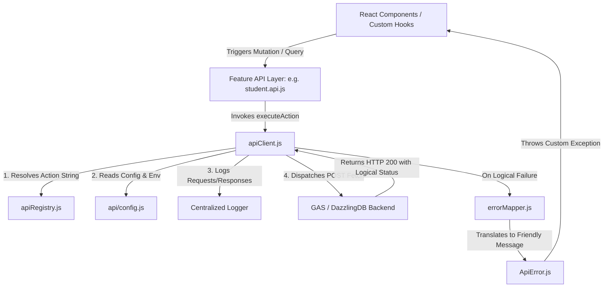

# Dazzling ERP - API Design Architecture Documentation

This document outlines the API design architecture, communication patterns, and error handling system implemented in the **Dazzling ERP Admin** client application under `src/services/`.

---

## 1. Core Architectural Paradigm

The client application integrates with a backend powered by **Google Apps Script (GAS) Web Apps** and a Google-Spreadsheet-backed storage engine (**DazzlingDB**).

Due to the nature of GAS Web Apps, standard RESTful endpoints (with multiple resource paths and standard HTTP verbs like `GET`, `PUT`, `DELETE`) are not natively feasible. Therefore, the system utilizes a **Single Endpoint RPC (Remote Procedure Call) Architecture**, utilizing a **Command Pattern**.

### Key Communication Rules:
1. **Single Endpoint Dispatching**: All API actions route to a single deployment URL defined by `VITE_API_BASE_URL` (typically `https://script.google.com/macros/s/.../exec`).
2. **CORS / Preflight Bypass**: Both the legacy and V2 clients set `'Content-Type': 'text/plain;charset=utf-8'`. This is a crucial design decision: sending JSON payloads with `'application/json'` triggers a CORS preflight `OPTIONS` request, which GAS cannot handle properly. Using `text/plain` bypasses the preflight check while passing valid JSON strings inside the request body.
3. **HTTP POST Only**: Since GAS web apps handle state updates and complex request dispatching best via `doPost(e)` functions, all remote queries and mutations are executed via HTTP `POST` requests.

---

## 2. Controls & Component Layers

The API communication architecture has transitioned from a manual service wrapper style (V1) to a structured, centralized command-dispatcher framework (V2).



### A. The Action Registry (`apiRegistry.js`)

The `apiRegistry.js` file establishes the central database for all operational capabilities available within the DazzlingDB ecosystem. Instead of hardcoding physical endpoints or action strings in disparate hooks or components, the client relies on a **Centralized Registry Pattern**.

#### 1. Design & Structure
The registry is structured as a nested JavaScript dictionary (`API_REGISTRY`), categorizing actions by domain namespacing:
```javascript
export const API_REGISTRY = {
  AUTH: {
    LOGIN: 'user_login',
    REGISTER: 'user_register',
    LOGOUT: 'user_logout'
  },
  STUDENT: {
    REGISTER: 'student_register'
  },
  ACADEMIC: {
    CREATE_COURSE: 'academic_create_course',
    CREATE_BATCH: 'academic_create_batch',
    // ...
  },
  // ...
};
```

This design provides key architectural benefits:
* **Domain-Driven Isolation**: Endpoints are grouped logically by sub-system (`AUTH`, `STUDENT`, `ACADEMIC`, `DATA`, `STAFF`, `ADMIN`, `BATCH`, `ATTENDANCE`). This improves code discoverability and leverages IDE auto-completion.
* **Backend Decoupling**: Frontend code references abstract business actions (e.g. `STUDENT.REGISTER`). If the backend changes its routine names (e.g. from `student_register` to `student_register_v2`), developers only need to update the string mapping in `apiRegistry.js`. The rest of the application remains unchanged.
* **Refactoring Safety**: Reduces the risk of silent spelling errors and duplicate definitions across different features.

#### 2. Action Resolution Protocol
When an action is initiated, the system uses a **dot-notation parsing strategy** inside the command dispatcher (`apiClient.js`):
```javascript
let backendActionString;

// 1. Resolve the backend action string from the registry
if (actionPath.includes('.')) {
  const [domain, actionName] = actionPath.split('.');
  backendActionString = API_REGISTRY[domain]?.[actionName];
} else {
  // Graceful fallback for direct resolved strings
  backendActionString = actionPath;
}

if (!backendActionString) {
  throw new ApiError(`Developer Error: Unregistered API Action: ${actionPath}`);
}
```

#### 3. How to Use the Registry
Feature-specific service files (e.g. `src/features/student/api/student.api.js`) invoke the registry implicitly through the API Client by passing a dot-notation identifier path:

##### Standard Service Call:
```javascript
import { apiClient } from '../../../services/apiClient';

/**
 * Register a student using the central registry path
 */
export const registerStudentService = async (studentPayload, sessionToken) => {
  // Resolves "STUDENT.REGISTER" to "student_register" at runtime
  const response = await apiClient.executeAction(
    'STUDENT.REGISTER', 
    studentPayload, 
    sessionToken
  );
  return response;
};
```
This pattern enforces strict separation of concerns, ensuring features do not hold knowledge of low-level transport mechanisms.

### B. The Command Dispatcher (`apiClient.js`)
All V2 service requests pass through `executeAction(actionPath, payload, token, options)`. Its pipeline performs the following tasks:
1. **Action Path Resolution**: Parses the action path (e.g., `STUDENT.REGISTER`) against the registry, falling back gracefully to the raw action string if not dot-notated.
2. **Standardized Envelope Construction**: Packs the command into a uniform payload structure:
   ```json
   {
     "action": "student_register",
     "payload": { ... },
     "token": "auth_token_here"
   }
   ```
3. **Observability & Logging**: Houses a centralized logger using `console.groupCollapsed`. It logs the raw payload, action path, and response envelope for high-visibility development debugging.
4. **Transport Execution**: Dispatches a standard `fetch` call to the active backend URL.

### C. Legacy Interface (`api.js`)
Maintains older manual function endpoints (e.g., `addStudent`, `addTeacher`, `query`, `retrieve`) wrapping `axios.post`. While these use similar payload structures, they hardcode the target production URL rather than resolving dynamic actions via the registry. All new feature development relies strictly on the V2 client (`apiClient.js`).

---

## 3. Error Handling and Exception Flow

Google Apps Script always returns an HTTP Status `200 OK` as long as the server executes successfully—even if a massive database exception or validation failure occurs within the script execution itself. 

To overcome this, the client implements a logical error extraction and mapping layer:

### 1. Payload Inspection
`apiClient.js` explicitly parses the JSON response envelope and checks for failure indicators:
```javascript
if (data.success === false || data.status === 'error') {
  const rawError = data.error || data.message;
  const friendlyMessage = getFriendlyErrorMessage(rawError, actionPath);
  throw new ApiError(friendlyMessage, response.status, rawError);
}
```

### 2. Error Translation (`errorMapper.js`)
Transforms cryptic database errors (e.g. system SQL error logs) into polite, clean end-user messages:
* `"not found"` $\rightarrow$ `"The requested record could not be found. It may have been deleted."`
* `"duplicate"` / `"already exists"` $\rightarrow$ `"A record with this information already exists in the system."`
* `"invalid token"` / `"unauthorized"` $\rightarrow$ `"Your session has expired or is invalid. Please log in again."`

### 3. Custom Exceptions (`ApiError.js`)
Defines the `ApiError` class extending `Error`. It preserves:
* The user-friendly parsed message.
* The original HTTP response status code (if any network issues occurred).
* The raw backend error body (`rawBackendError`) for developer troubleshooting.

---

## 4. Configuration and Environment Management (`api/config.js`)

Provides dynamic controls for endpoint routing and runtime modes:
* **`VITE_API_BASE_URL`**: Set inside `.env` files to route requests to production deployments or development environments.
* **`VITE_API_MODE`**: Determines whether the frontend runs in `'REAL'` mode (sending network calls to GAS) or `'MOCK'` mode (using local mock APIs for quick UI development and offline previews).
* **`getFullUrl(endpointKey)`**: Construct URL endpoints dynamically using environment configurations.
