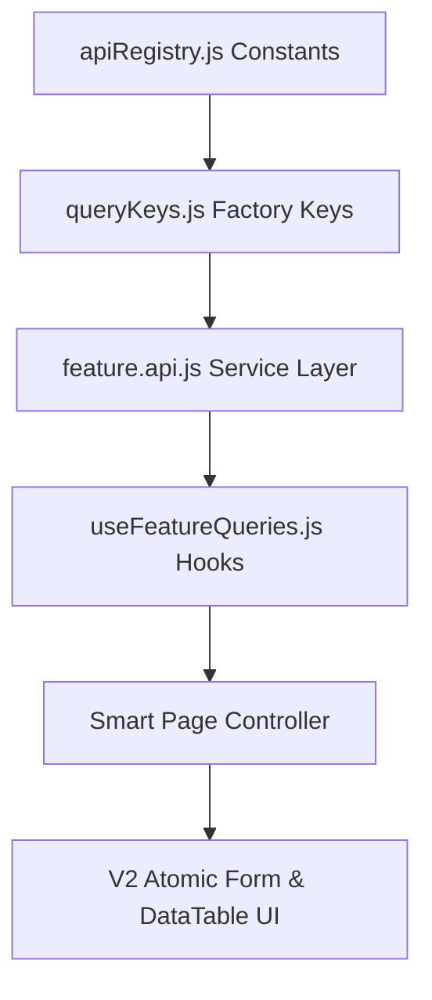

# Architectural Guide: Adding a New Table Section

This document defines the production standards, patterns, and code blueprints required to implement a new database-backed CRUD section (feature module) in the **Dazzling ERP Admin** frontend dashboard.

---

## 1. Architectural Sequence

When introducing a new module (e.g., `Branch`), the implementation must flow sequentially from the service layer to the presentation layer:



---

## 2. Directory Mappings

Every new feature module must be segregated under its own feature folder to enforce separation of concerns:

```
src/
├── features/
│   └── [feature]/
│       ├── api/
│       │   └── [feature].api.js          # Pure client fetch interfaces
│       ├── hooks/
│       │   └── use[Feature]Queries.js    # useQuery & useMutation hooks
│       └── components/
│           ├── [Feature]Form.jsx         # Selection/Input forms
│           └── [Feature]DetailModal.jsx  # Context modal sheets
└── pages/
    └── admin/
        └── [Feature]s.jsx                # Smart Page Controller (routed)
```

---

## 3. Step-by-Step Implementation Blueprints

### Step 1: Register Action Keys in `apiRegistry.js`
All interactions with the backend Google Apps Script must resolve through [apiRegistry.js](file:///e:/NAST/Dazzling/ERP%20System/dazzling-erp-admin/src/services/apiRegistry.js). Add your domain action keys here:
```javascript
export const API_REGISTRY = {
  // ... existing sections
  BRANCH: {
    CREATE: 'data_create',
    UPDATE: 'data_update',
    DELETE: 'data_delete'
  }
};
```

---

### Step 2: Establish Centralized Query Keys
Register your keys in [queryKeys.js](file:///e:/NAST/Dazzling/ERP%20System/dazzling-erp-admin/src/lib/react-query/queryKeys.js) using the Query Key Factory pattern:
```javascript
export const queryKeys = {
  branch: {
    all: ['branch'],
    list: (filter = EMPTY_FILTER) => [...queryKeys.branch.all, 'list', { filter }],
    detail: (id) => [...queryKeys.branch.all, 'detail', id],
  }
};
```

---

### Step 3: Implement Pure API Services
Create your service layer (e.g., `branch.api.js`) under `src/features/[feature]/api/`. Rely exclusively on [apiClient.js](file:///e:/NAST/Dazzling/ERP%20System/dazzling-erp-admin/src/services/apiClient.js):
```javascript
import { executeAction } from '../../../services/apiClient';
import { API_REGISTRY } from '../../../services/apiRegistry';

/**
 * @async
 * @function fetchBranches
 */
export const fetchBranches = (token, filter = {}, options = {}) => 
  executeAction(API_REGISTRY.DATA.QUERY, { target: 'Branch', where: filter }, token, options);

/**
 * @async
 * @function deleteBranch
 */
export const deleteBranch = (token, id, options = {}) => 
  executeAction(API_REGISTRY.DATA.DELETE, { table: 'Branch', id }, token, options);
```

---

### Step 4: Write Custom React Query Hooks
Encapsulate Queries and Mutations inside `use[Feature]Queries.js`. 

#### The Cache Detail Fallback Pattern:
To optimize performance, direct detail hooks must first resolve from local caches before executing queries:
```javascript
export const useBranchDetailQuery = (id) => {
  const { token } = useAuth();
  const queryClient = useQueryClient();

  return useQuery({
    queryKey: queryKeys.branch.detail(id),
    queryFn: async ({ signal }) => {
      const response = await fetchBranchDetail(token, id, { signal });
      return response.data?.data?.[0] || null;
    },
    enabled: !!token && !!id,
    initialData: () => {
      if (!id) return undefined;
      // 1. Direct Detail Cache
      const cachedDetail = queryClient.getQueryData(queryKeys.branch.detail(id));
      if (cachedDetail) return cachedDetail;

      // 2. List Cache Fallback
      const listQueries = queryClient.getQueriesData({ queryKey: queryKeys.branch.list() });
      for (const [_, listData] of listQueries) {
        if (Array.isArray(listData)) {
          const item = listData.find(b => b.branch_id === id);
          if (item) return item;
        }
      }
      return undefined;
    },
    initialDataUpdatedAt: () => queryClient.getQueryState(queryKeys.branch.detail(id))?.dataUpdatedAt,
    staleTime: 1000 * 60 * 5, // 5 minutes
  });
};
```

#### Mutation Invalidation Template:
```javascript
export const useDeleteBranchMutation = () => {
  const { token } = useAuth();
  const queryClient = useQueryClient();

  return useMutation({
    mutationFn: ({ id, options }) => deleteBranch(token, id, options),
    onSuccess: () => {
      // Invalidate list cache keys to trigger automatic refetches
      queryClient.invalidateQueries({ queryKey: queryKeys.branch.all });
    }
  });
};
```

---

### Step 5: Design Forms with Atomic V2 Inputs
Always build forms with unified V2 atomic input elements to maintain aesthetic Dark Mode slate grids:
```javascript
import FormField from '../../../components/ui/v2/FormField';
import TextInput from '../../../components/ui/v2/TextInput';
import SelectInput from '../../../components/ui/v2/SelectInput';

const BranchForm = ({ initialData, onSubmit, isPending }) => {
  return (
    <form className="space-y-4">
      <FormField label="Branch Name" required>
        <TextInput name="branch_name" placeholder="Enter branch name" />
      </FormField>
      <FormField label="Status">
        <SelectInput 
          name="status"
          options={[{ label: 'Active', value: 'active' }, { label: 'Inactive', value: 'inactive' }]}
        />
      </FormField>
    </form>
  );
};
```

---

### Step 6: Create the Smart Page Controller
The page controller acts as the orchestrator mapping data queries to presentation UI templates:

*   **State Separation**: Keep modal open flags in React state; cache collection tables in TanStack query cache.
*   **Deletion Error Boundaries**: Handle confirmations using `ConfirmModal`, validating and bubbling backend errors dynamically:

```javascript
const handleConfirmDelete = () => {
  if (!deleteModal.id) return;
  setDeleteModal(prev => ({ ...prev, status: 'processing' }));
  
  deleteMutation.mutate({ id: deleteModal.id }, {
    onSuccess: (res) => {
      setDeleteModal(prev => ({
        ...prev,
        status: 'success',
        resultMessage: res.message || 'Records successfully removed.'
      }));
    },
    onError: (err) => {
      setDeleteModal(prev => ({
        ...prev,
        status: 'error',
        resultMessage: err.message || 'Connection error. Please check your network.'
      }));
    }
  });
};
```

---

## 4. Quality Rules Checklist

Before pushing a new feature section to staging, ensure you can tick off all boxes:

- [ ] **No Axios in Feature Folder**: Checked that no custom `axios` instances or `api.js` endpoints are imported.
- [ ] **Schema Check**: Verified all field keys map exactly to relational structures in the decoupled schema files under [Config/Schema/](file:///E:/NAST/Dazzling/GAS/DazzlingDB/Config/Schema/).
- [ ] **Query key invalidation**: Successful deletion/updating invalidates the correct `queryKeys.[feature].all` keys.
- [ ] **No Inline Styles**: Reused global CSS classes, theme design tokens, or HSL utilities exclusively.
- [ ] **Form Skeletons**: Forms display dynamic loading spinners or skeletons during server transaction periods.
- [ ] **Detailed JSDoc**: Functions contain comments outlining inputs, return types, and context behaviors.
