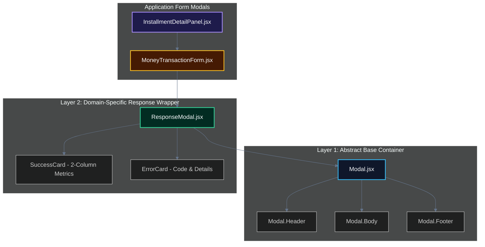

# Deep Dive: Student Fee Payment → MoneyTransaction General Ledger Sync Architecture

> **Author**: Antigravity Technical Architecture Team  
> **Topic**: Dual-Entry Ledger Reconciliation, 3-Part Composite Keys & 2-Stage Modal Flow  
> **Target Audience**: Core ERP Developers, Financial Module Engineers, and Technical Auditors  

---

## 1. Executive Summary & Architectural Motivation

In modern ERP systems, **domain decoupling** is essential for maintaining separation of concerns between operational features (such as Student Fee Schedules) and core accounting systems (such as the General Money Transaction Ledger). 

When a student pays an installment (e.g. ₹25,000 via UPI for Semester 1 Fees), two separate database domains must be updated:
1. **Student Account Domain** (`StudentFeeAccount` & `StudentFeeInstallment`): Updates student balance, payment receipt history, and installment status (`PAID` / `PARTIAL`).
2. **General Ledger Domain** (`MoneyTransaction`): Records institutional income (`type: 'in'`), mapping cash/digital inflow to financial categories for audited reporting and revenue metrics.

To ensure consistency across both decoupled domains, Dazzling ERP implements a **2-Stage Payment & Ledger Sync Architecture** powered by a **3-Part Composite Reference Key** and a **2-Layer Composition Modal System**.

---

## 2. Interactive Flow & Sequence Architecture

The diagram below visualizes the complete lifecycle of a student payment, from initial user input to double-entry ledger verification and flash feedback pop-up rendering.

```mermaid
%%{init: {'theme': 'dark', 'themeVariables': { 'darkMode': true, 'background': '#0f172a', 'primaryColor': '#1e293b', 'primaryTextColor': '#f8fafc', 'primaryBorderColor': '#334155', 'lineColor': '#64748b', 'secondaryColor': '#0f172a', 'tertiaryColor': '#1e293b'}}}%%
sequenceDiagram
    autonumber
    actor Admin as Finance Admin
    participant RPM as RecordPaymentModal (Stage 1)
    participant API as GAS REST API Client
    participant MTF as MoneyTransactionForm (Stage 2)
    participant IDP as InstallmentDetailPanel
    participant RM as ResponseModal (Flash Pop-up)
    participant Cache as TanStack Query Cache

    rect rgb(15, 23, 42)
        note over Admin, API: STAGE 1: RECORD STUDENT PAYMENT
        Admin->>RPM: Input Amount, Method & Payment Date
        Admin->>RPM: Click Submit Payment
        RPM->>API: dispatch(STUDENT_PAYMENT_TRANSACTION, payload)
        API-->>RPM: Response { success: true, payment_id: "PMT-001001" }
        RPM->>Cache: Invalidate ['finance'] & ['enrollment']
    end

    rect rgb(30, 41, 59)
        note over RPM, MTF: TRANSITION: DERIVE 3-PART COMPOSITE KEY
        RPM->>RPM: Compute Key = ${student_fee_id}_${installment_id}_${payment_id}
        RPM->>RPM: Build initialData (No transaction_id -> Forces data_create)
        RPM->>MTF: Launch MoneyTransactionForm(initialData)
    end

    rect rgb(15, 23, 42)
        note over Admin, RM: STAGE 2: RECORD GENERAL LEDGER ENTRY
        Admin->>MTF: Select Accounting Category (Mandatory)
        Admin->>MTF: Click Save Transaction
        MTF->>API: executeAction(DATA.CREATE, table: 'MoneyTransaction')
        API-->>MTF: Response { success: true, transaction_id: "MTX-009812" }
        MTF->>RM: Open ResponseModal variant="success"
        RM-->>Admin: Display Formatted Metrics (MTX ID, Composite Key, Amount)
        Admin->>RM: Click Done
        MTF->>Cache: Invalidate ['finance', 'money-transactions']
    end

    rect rgb(30, 41, 59)
        note over IDP: SINGLE SOURCE OF TRUTH VERIFICATION
        Cache-->>IDP: Re-render with updated moneyTransactions
        IDP->>IDP: checkIsInstallmentSynced(studentFeeId, installmentId, paymentId)
        IDP-->>Admin: Display Green Sync Icon (sync)
    end
```



---

## 3. The 2-Stage Transactional Workflow

### Stage 1: Student Payment Recording (`RecordPaymentModal.jsx`)
In Stage 1, the user enters payment details specific to the student's fee structure. 
- **Form Controls**: Select target installment, amount paid, payment mode (`Cash`, `UPI`, `Bank Transfer`, `Cheque`), and transaction date.
- **Backend Dispatch**: Triggers `finance_record_payment` via `API_REGISTRY.FINANCE.STUDENT_PAYMENT_TRANSACTION`.
- **Response Handling**: The GAS backend returns the newly generated payment record object containing `payment_id` (e.g., `PMT-001001`).

### Transition & Key Derivation
Upon Stage 1 completion, `RecordPaymentModal` automatically constructs a **3-part composite key** and transforms Stage 1 data into a pre-filled `initialData` object for Stage 2:

```javascript
const pmtId = res?.data?.data?.payment_id || res?.data?.payment_id || res?.payment_id || `PMT-${Date.now()}`;
const compositeKey = `${studentFeeId}_${installmentId}_${pmtId}`;

const derivedTxData = {
  type: 'in', // Financial Inflow
  amount: numericAmountPaid,
  transaction_date: paymentDate,
  category_id: '', // Left empty for user to pick in Stage 2
  payment_method: mappedChannel, // e.g. 'phonepe', 'cash', 'bank'
  payment_reference: compositeKey, // 3-Part Composite Reference Key
  notes: `Student Fee Payment - Installment #${targetIndex + 1} (${programName})`,
  remarks: remarks.trim() || '',
  party_type: 'student',
  party_id: studentId,
  party_name: studentName,
  by: currentUserName,
  reconciliation_status: 'unreconciled'
  // Crucial: NO transaction_id or id passed here!
};
```

### Stage 2: General Ledger Recording (`MoneyTransactionForm.jsx`)
In Stage 2, the prebuilt `MoneyTransactionForm` drawer opens with fields pre-filled.
- **Mandatory Selection**: The user selects the accounting category (e.g., *Tuition Fee Income*).
- **Create vs. Update Guard**: Because `initialData` has **no `transaction_id`**, `MoneyTransactionForm` correctly dispatches `createMutation` (`data_create` with no ID) instead of updating an existing record:
  ```javascript
  if (initialData && (initialData.transaction_id || initialData.id)) {
    await updateMutation.mutateAsync({ id: initialData.transaction_id || initialData.id, data: payload });
  } else {
    await createMutation.mutateAsync(payload); // Dispatches data_create
  }
  ```

---

## 4. The 3-Part Composite Reference Key Architecture

### Mathematical Formulation

$$\text{Composite Reference Key} = \text{student\_fee\_id} + \text{"\_"} + \text{installment\_id} + \text{"\_"} + \text{payment\_id}$$

$$\text{Example: } \text{"SFA-002002\_INS-002001\_PMT-001001"}$$

### Deep Dive: Resolving the Multi-Payment False-Positive Bug

Earlier iterations used a 2-part key (`student_fee_id_installment_id`). This introduced a critical edge-case flaw during partial or multi-payment scenarios:

```
[SCENARIO: Installment INS-002001 (Total: ₹25,000)]
├─ Payment #1 (PMT-001001): ₹10,000 paid on July 10  --> Synced to Ledger
└─ Payment #2 (PMT-001002): ₹15,000 paid on July 25  --> NOT YET SYNCED
```

#### Why 2-Part Keys Failed:
- Both Payment #1 and Payment #2 belong to `INS-002001`.
- With 2-part keys, both payments evaluated key `SFA-002002_INS-002001`.
- When Payment #1 synced, key `SFA-002002_INS-002001` was added to `MoneyTransaction`.
- When Payment #2 rendered, it queried `MoneyTransaction` for `SFA-002002_INS-002001`, found Payment #1's row, and **falsely marked itself as `Synced`**!

#### How 3-Part Keys Fix It:
With 3-part keys, each payment gets an isolated reference:
- Payment #1 key: `SFA-002002_INS-002001_PMT-001001` $\rightarrow$ **Found in Ledger** ($\text{Status} = \mathbf{Synced}$)
- Payment #2 key: `SFA-002002_INS-002001_PMT-001002` $\rightarrow$ **Not Found** ($\text{Status} = \mathbf{Not\ Synced}$)

---

## 5. Single Source of Truth Sync Check Algorithm

The sync status of any payment receipt card in `InstallmentDetailPanel.jsx` is dynamically computed against the cached array of `MoneyTransaction` records using a single-pass lookup:

```javascript
/**
 * Single Source of Truth Sync Check Helper
 * Checks if a MoneyTransaction entry exists with payment_reference === `${studentFeeId}_${installmentId}_${paymentId}`
 *
 * @param {string} studentFeeId - Target StudentFeeAccount ID (e.g. SFA-002002)
 * @param {string} installmentId - Target Installment ID (e.g. INS-002001)
 * @param {string} paymentId - Target Payment Receipt ID (e.g. PMT-001001)
 * @returns {boolean} True if synced in general ledger, false otherwise
 */
const checkIsInstallmentSynced = (studentFeeId, installmentId, paymentId) => {
  if (!studentFeeId || !installmentId || !paymentId) return false;
  const compositeKey = `${studentFeeId}_${installmentId}_${paymentId}`;
  return moneyTransactions.some(tx => (tx.payment_reference || '').trim() === compositeKey);
};
```

---

## 6. Layered Composition Modal Architecture (`Modal` & `ResponseModal`)

To ensure clean separation between general modal mechanics and response flash pop-ups, the application utilizes a **2-Layer Composition Pattern**:



### Layer 1: Abstract Base `Modal` ([src/components/ui/Modal.jsx](file:///e:/NAST/Dazzling/ERP%20System/dazzling-erp-admin/src/components/ui/Modal.jsx))
- Focuses purely on portal rendering, backdrop blur, keyboard `Escape` dismissal, and theme container classes.
- Completely domain-agnostic.

### Layer 2: Domain-Specific `ResponseModal` ([src/components/ui/ResponseModal.jsx](file:///e:/NAST/Dazzling/ERP%20System/dazzling-erp-admin/src/components/ui/ResponseModal.jsx))
- Composes on top of `Modal`.
- Formats success responses using a 2-column key-value grid (`Transaction ID`, `Composite Key`, `Amount Deposited`, `Party Name`, `Channel`, `Logged By`).
- Formats error responses using an alert card (`Error Code`, `Message`, `Details`, `Retry Action`).

---

## 7. Component Interaction & Registry Matrix

| Component | Path | Role & Key Properties |
| :--- | :--- | :--- |
| **`Modal`** | `src/components/ui/Modal.jsx` | Layer 1 abstract container (`isOpen`, `onClose`, `size`, compound slots) |
| **`ResponseModal`** | `src/components/ui/ResponseModal.jsx` | Layer 2 flash pop-up wrapper (`variant`, `items`, `errorObj`, `onRetry`) |
| **`RecordPaymentModal`** | `src/features/finance/RecordPaymentModal.jsx` | Stage 1 payment form + Stage 2 transition orchestration |
| **`MoneyTransactionForm`** | `src/features/finance/transactions/components/MoneyTransactionForm.jsx` | Stage 2 ledger form drawer (`initialData` create vs update handler) |
| **`InstallmentDetailPanel`** | `src/features/student/components/profile/fee/InstallmentDetailPanel.jsx` | Parent side panel, queries `moneyTransactions`, hosts Stage 2 sync modal |
| **`PaymentReceiptCard`** | `src/features/student/components/profile/fee/PaymentReceiptCard.jsx` | Child payment item card displaying green `sync` / red `sync_problem` icons |

---

## 8. Manual Sync Recovery Workflow

If an existing payment receipt in the database was recorded prior to the 2-stage workflow or failed Stage 2 ledger entry creation, `InstallmentDetailPanel` provides a 1-click **Manual Sync Recovery Action**:

1. The payment card evaluates `checkIsInstallmentSynced` $\rightarrow$ returns `false`.
2. The card header renders a **Red Pulsing Unsynced Icon** (`sync_problem` in `text-rose-500 animate-pulse`).
3. Expanding the card reveals the **Sync Ledger Entry** button (`variant="contained"`, `startIcon="sync"`).
4. Clicking **Sync** constructs the 3-part composite key and launches `MoneyTransactionForm` pre-filled for immediate ledger entry!
