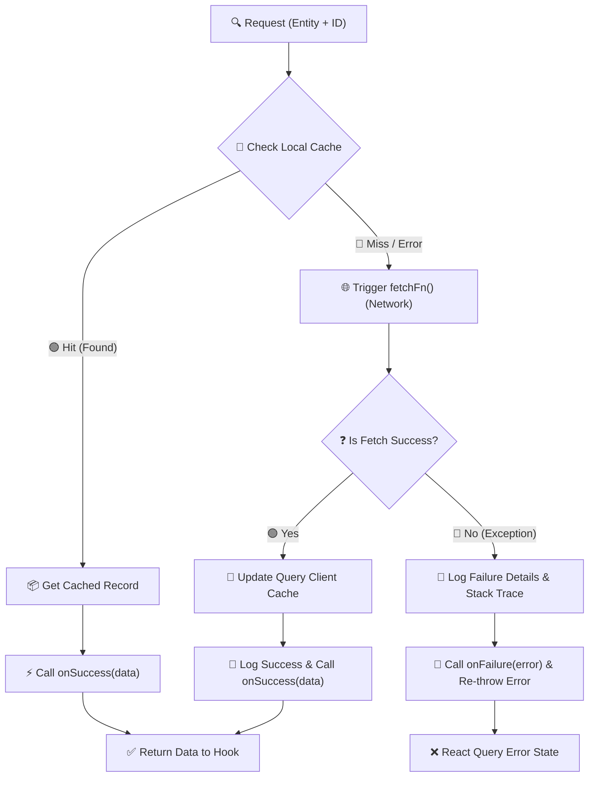

# Redesign Data Fetch Pipeline to a Reusable Cache-First Strategy

This plan outlines the architecture for a robust, reusable caching and resolution pipeline using React Query. It is designed to maximize local cache reuse, minimize network requests, and prevent background fetching when data exists in either list or detailed caches.

## User Review Required

> [!IMPORTANT]
> **Centralized key mapping & Callback Pipeline**:
> - We will map the entities (`student`, `teacher`, `batch`, `course`, `package`) directly to their keys inside [queryKeys.js](e:/NAST/Dazzling/ERP System/dazzling-erp-admin/src/lib/react-query/queryKeys.js) inside the helper file.
> - **Production-Grade Exception Handling & Logging**:
>   - We wrap the asynchronous pipeline in `try/catch` blocks.
>   - We implement optional `onSuccess(data)` and `onFailure(error)` handlers inside the pipeline settings so components or hooks can register callbacks.
>   - All logs will use clear tags (e.g., `[CacheHelper:Success]`, `[CacheHelper:Error]`) containing entity type, ID, source (cache vs network), and timestamp.
>   - Thrown exceptions will be logged and re-thrown to let React Query transition the query status to `error` state.

### 📊 Data Flow & Exception Handling Pipeline



## Proposed Changes

### Core React Query Layer

#### [NEW] [cacheHelper.js](e:/NAST/Dazzling/ERP System/dazzling-erp-admin/src/lib/react-query/cacheHelper.js)
- Import `queryKeys` and `EMPTY_FILTER` from `queryKeys.js`.
- Define `ENTITY_CONFIGS` mapping domains to their exact key builders and unique column identifiers.
- Export `getCachedRecord(queryClient, entity, id)` for synchronous initial data resolution.
- Export `resolveRecord(queryClient, entity, id, fetchFn, options)` for asynchronous cached retrieval with error safety.
  - Options will accept: `{ strategy, onSuccess, onFailure }`.

##### Exception Handling & Logging Implementation Design
Here is the code architecture we will implement in `cacheHelper.js` for robust error catching and logging:

```javascript
/**
 * Resolves a record by checking the cache first, then querying the network if needed.
 * Incorporates robust exception handling, logging, and onSuccess/onFailure callbacks.
 */
export async function resolveRecord(queryClient, entity, id, fetchFn, options = {}) {
  const { onSuccess, onFailure } = options;
  const config = ENTITY_CONFIGS[entity];
  
  if (!config) {
    const error = new Error(`[CacheHelper] Unsupported entity type: ${entity}`);
    console.error(`[CacheHelper:Error] Config resolution failed.`, { entity, id, error });
    if (onFailure) onFailure(error);
    throw error;
  }

  // 1. Try resolving from Cache
  try {
    const cachedData = getCachedRecord(queryClient, entity, id);
    if (cachedData) {
      console.log(`[CacheHelper:Success] Resolved from Cache.`, {
        entity,
        id,
        timestamp: new Date().toISOString()
      });
      if (onSuccess) onSuccess(cachedData);
      return cachedData;
    }
  } catch (cacheError) {
    // Cache lookup failures should not block network fetch, but we log them
    console.warn(`[CacheHelper:Warning] Cache lookup error (continuing to network fetch):`, {
      entity,
      id,
      error: cacheError.message
    });
  }

  // 2. Fetch from Network & Update Cache
  console.log(`[CacheHelper:CacheMiss] Fetching from network...`, { entity, id });
  try {
    const data = await fetchFn();
    
    // Validate returned record structure
    if (!data) {
      throw new Error(`Received empty or null response for ${entity} with ID ${id}`);
    }

    // Update detailed cache
    const detailKey = config.detailKey(id);
    queryClient.setQueryData(detailKey, data);

    console.log(`[CacheHelper:Success] Resolved from Network. Cache updated.`, {
      entity,
      id,
      timestamp: new Date().toISOString()
    });

    if (onSuccess) onSuccess(data);
    return data;
  } catch (fetchError) {
    const contextError = new Error(`[CacheHelper:Error] Failed resolving ${entity} (${id}): ${fetchError.message}`);
    contextError.originalError = fetchError;

    console.error(`[CacheHelper:Error] Network fetch or cache update failed.`, {
      entity,
      id,
      error: fetchError.message || fetchError,
      stack: fetchError.stack
    });

    if (onFailure) onFailure(contextError);
    throw contextError; // Re-throw to propagate to React Query
  }
}
```

### Domain Query Hooks

#### [MODIFY] [useStudentQueries.js](e:/NAST/Dazzling/ERP System/dazzling-erp-admin/src/features/student/hooks/useStudentQueries.js)
- Import `getCachedRecord` and `resolveRecord` from `cacheHelper.js`.
- Refactor `useStudentDetailQuery`'s `queryFn` and `initialData` to use the helpers.

#### [MODIFY] [useTeacherQueries.js](e:/NAST/Dazzling/ERP System/dazzling-erp-admin/src/features/teacher/hooks/useTeacherQueries.js)
- Import `getCachedRecord` and `resolveRecord` from `cacheHelper.js`.
- Refactor `useTeacherDetailQuery`'s `queryFn` and `initialData` to use the helpers.

#### [MODIFY] [useCourseQueries.js](e:/NAST/Dazzling/ERP System/dazzling-erp-admin/src/features/course/hooks/useCourseQueries.js)
- Import `getCachedRecord` and `resolveRecord` from `cacheHelper.js`.
- Refactor `useCourseDetailQuery` and `usePackageDetailQuery` to use the helpers.

#### [MODIFY] [useBatchQueries.js](e:/NAST/Dazzling/ERP System/dazzling-erp-admin/src/features/batch/hooks/useBatchQueries.js)
- Import `getCachedRecord` and `resolveRecord` from `cacheHelper.js`.
- Refactor `useBatchDetailQuery` to use the helpers.

## Verification Plan

### Automated/Syntax Verification
- Ensure code compiles with no syntax errors.

### Manual Verification
- Test student/teacher/course registration flows.
- Monitor browser Network tab to ensure navigate actions do not trigger duplicate queries or redundant API calls.
- View application console logs during query actions to verify cache hit, miss, warning, and error logging outputs.
