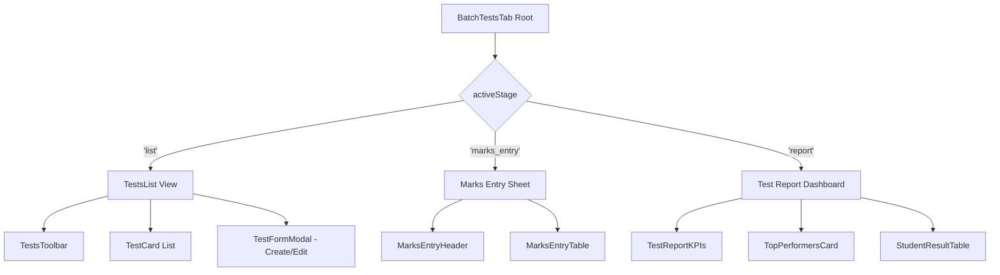

# Roadmap & Directory Architecture for Batch Test Management Tab

This document outlines the component roadmap and nested directory structure for building the **Batch/Class Test Management** module inside the Batch Details view (`DesktopBatchProfile.jsx`).

---

## 1. Directory Structure Blueprint

In accordance with feature conventions, tab sub-components are organized under `src/features/batch/components/profile/tests/`:

```
src/features/batch/
├── hooks/
│   └── useBatchTestQueries.js                   # TanStack Query hooks (CRUD, Bulk Save, Reports)
│
└── components/profile/
    ├── BatchTestsTab.jsx                       # Main Tab Container mounted in DesktopBatchProfile
    └── tests/
        ├── components/
        │   ├── TestsToolbar.jsx                 # Search, Status Filter & Create Button
        │   ├── TestCard.jsx                    # Single Test summary card with state actions
        │   ├── TestsList.jsx                    # Card grid list with loading & empty states
        │   │
        │   ├── MarksEntryHeader.jsx            # Header for bulk marks entry mode
        │   ├── MarksEntryTable.jsx             # Class-wide bulk marks entry table
        │   ├── MarksEntryRow.jsx               # Row component with validation & absent toggle
        │   │
        │   ├── TestReportKPIs.jsx              # Analytics summary (Avg, Pass %, High/Low)
        │   ├── TopPerformersCard.jsx           # Leaderboard for top rankers
        │   ├── StudentResultTable.jsx          # Detailed marks, grade & rank matrix
        │   │
        │   └── TestFormModal.jsx               # Create & Edit Test Modal dialog
        │
        └── utils/
            └── testCalculators.js              # Grade calculations, ranks & percentage helpers
```

---

## 2. Component Roadmap & Stage Flow

The `BatchTestsTab` manages a 3-stage state (`list`, `marks_entry`, `report`):



### Phase 1: Core Layout & List View
1. **`useBatchTestQueries.js`**: Connect queries for fetching tests by `batch_id`, registering keys in `queryKeys.js` under `queryKeys.test`.
2. **`TestsToolbar.jsx`**: Title search using `TextInput`, status filter (`Draft`, `Published`, `Completed`) using `SelectInput`, and "+ Create Test" button using `Button` (`variant="contained"`).
3. **`TestCard.jsx`**: Built with `Card` compound elements (`Card.Header`, `Card.Body`, `Card.Footer`). Render test parameters, badge status using `Badge`, and trigger buttons using `Button`.
4. **`TestsList.jsx`**: Container mapping array of tests or empty states.
5. **`TestFormModal.jsx`**: Modal dialog using `Modal` primitive with `FormField`, `TextInput`, `DateInput`, `SelectInput`, and `Button` controls for creating/updating tests.

### Phase 2: Bulk Marks Entry Sub-Module
1. **`MarksEntryHeader.jsx`**: Metadata bar with batch title, total marks, back button, and "Save All Marks" submit button using `Button`.
2. **`MarksEntryTable.jsx`**: Table interface mapping enrolled students for the batch using `DataTableV2` / custom dense matrix.
3. **`MarksEntryRow.jsx`**: Live validation (obtained marks $\le$ total marks), auto-zeroing/disabling on `is_absent` checkbox toggle.

### Phase 3: Analytics & Test Report Sub-Module
1. **`testCalculators.js`**: Helper using `queryEngine.js` (`aq`) and `date-fns` for computing average, pass percentage, grades (A, B, C, F), and rankings.
2. **`TestReportKPIs.jsx`**: Grid of `KpiCard` components (Total, Present, Absent, Average, Pass %, Fail %).
3. **`TopPerformersCard.jsx`**: Leaderboard for top rankers built with `Card`.
4. **`StudentResultTable.jsx`**: Comprehensive student breakdown with search & grade indicators built with `DataTableV2`.

---

## 3. Mandatory UI Component Catalog Mapping

To satisfy the zero-new-ui-components policy, all layout elements map directly to existing primitives in `src/components/`:

| UI Feature | Target Primitive Component | Source Location |
| :--- | :--- | :--- |
| Test Card Container | `Card` (`Card.Header`, `Card.Body`, `Card.Footer`) | `src/components/ui/Card.jsx` |
| Search Filter | `TextInput` | `src/components/ui/v2/TextInput.jsx` |
| Status Filter Dropdown | `SelectInput` | `src/components/ui/v2/SelectInput.jsx` |
| Test Date Input | `DateInput` | `src/components/ui/v2/DateInput.jsx` |
| Form Fields | `FormField` | `src/components/ui/v2/FormField.jsx` |
| Action Triggers / Submits | `Button` | `src/components/ui/v2/Button.jsx` |
| Status Indicator | `Badge` | `src/components/ui/Badge.jsx` |
| Summary KPIs | `KpiCard` | `src/components/ui/v2/KpiCard.jsx` |
| Create / Edit Modal | `Modal` | `src/components/ui/Modal.jsx` |
| Result Matrix Table | `DataTableV2` | `src/components/ui/table/DataTableV2.jsx` |

---

## 4. Method Signatures & Calculation Blueprints

### JSDoc Positional Signatures (`testCalculators.js`)

```javascript
import { aq, op } from 'src/lib/queryEngine';
import { parseISO, format } from 'date-fns';

/**
 * Computes test report statistics, ranks, grades, and top performers.
 * @param {Array<Object>} marksRecords - List of TestMarks records for a given test.
 * @param {number} totalMarks - Maximum total marks achievable for the test.
 * @param {number} passingMarks - Minimum marks required to pass.
 * @returns {Object} Analytical payload { kpis, toppers, studentResults }.
 * @throws {Error} If totalMarks <= 0 or marksRecords is invalid.
 */
export function calculateTestReport(marksRecords = [], totalMarks = 100, passingMarks = 40) {
  if (!totalMarks || totalMarks <= 0) {
    throw new Error('[calculateTestReport] totalMarks must be a positive integer');
  }

  const dt = aq(marksRecords)
    .derive({
      obtained: d => d.is_absent ? 0 : Number(d.obtained_marks || 0),
      percentage: d => d.is_absent ? 0 : ((Number(d.obtained_marks || 0) / totalMarks) * 100),
      isPass: d => !d.is_absent && (Number(d.obtained_marks || 0) >= passingMarks)
    })
    .orderby('-obtained');

  const toppers = dt.filter(d => !d.is_absent).slice(0, 3).objects();

  return {
    kpis: {
      total: marksRecords.length,
      present: marksRecords.filter(m => !m.is_absent).length,
      absent: marksRecords.filter(m => m.is_absent).length,
      average: dt.rollup({ avg: op.mean('obtained') }).object().avg || 0,
      highest: dt.rollup({ max: op.max('obtained') }).object().max || 0,
      lowest: dt.rollup({ min: op.min('obtained') }).object().min || 0,
    },
    toppers,
    studentResults: dt.objects()
  };
}
```

---

## User Review Required

> [!NOTE]
> Please review the proposed component directory structure (`src/features/batch/components/profile/tests/`) and phased implementation roadmap.

---

## Open Questions

None at this time.

---

## Proposed Changes

### Feature: Batch Test Management

#### [NEW] [useBatchTestQueries.js](file:///e:/NAST/Dazzling/ERP%20System/dazzling-erp-admin/src/features/batch/hooks/useBatchTestQueries.js)
#### [NEW] [BatchTestsTab.jsx](file:///e:/NAST/Dazzling/ERP%20System/dazzling-erp-admin/src/features/batch/components/profile/BatchTestsTab.jsx)
#### [NEW] [TestsToolbar.jsx](file:///e:/NAST/Dazzling/ERP%20System/dazzling-erp-admin/src/features/batch/components/profile/tests/components/TestsToolbar.jsx)
#### [NEW] [TestCard.jsx](file:///e:/NAST/Dazzling/ERP%20System/dazzling-erp-admin/src/features/batch/components/profile/tests/components/TestCard.jsx)
#### [NEW] [TestsList.jsx](file:///e:/NAST/Dazzling/ERP%20System/dazzling-erp-admin/src/features/batch/components/profile/tests/components/TestsList.jsx)
#### [NEW] [MarksEntryHeader.jsx](file:///e:/NAST/Dazzling/ERP%20System/dazzling-erp-admin/src/features/batch/components/profile/tests/components/MarksEntryHeader.jsx)
#### [NEW] [MarksEntryTable.jsx](file:///e:/NAST/Dazzling/ERP%20System/dazzling-erp-admin/src/features/batch/components/profile/tests/components/MarksEntryTable.jsx)
#### [NEW] [MarksEntryRow.jsx](file:///e:/NAST/Dazzling/ERP%20System/dazzling-erp-admin/src/features/batch/components/profile/tests/components/MarksEntryRow.jsx)
#### [NEW] [TestReportKPIs.jsx](file:///e:/NAST/Dazzling/ERP%20System/dazzling-erp-admin/src/features/batch/components/profile/tests/components/TestReportKPIs.jsx)
#### [NEW] [TopPerformersCard.jsx](file:///e:/NAST/Dazzling/ERP%20System/dazzling-erp-admin/src/features/batch/components/profile/tests/components/TopPerformersCard.jsx)
#### [NEW] [StudentResultTable.jsx](file:///e:/NAST/Dazzling/ERP%20System/dazzling-erp-admin/src/features/batch/components/profile/tests/components/StudentResultTable.jsx)
#### [NEW] [TestFormModal.jsx](file:///e:/NAST/Dazzling/ERP%20System/dazzling-erp-admin/src/features/batch/components/profile/tests/components/TestFormModal.jsx)
#### [NEW] [testCalculators.js](file:///e:/NAST/Dazzling/ERP%20System/dazzling-erp-admin/src/features/batch/components/profile/tests/utils/testCalculators.js)
#### [MODIFY] [DesktopBatchProfile.jsx](file:///e:/NAST/Dazzling/ERP%20System/dazzling-erp-admin/src/pages/admin/components/DesktopBatchProfile.jsx)

---

## Verification Plan

### Manual Verification
1. Open Batch Details view in browser.
2. Select **Tests** tab and verify the list rendering & toolbar functionality.
3. Test creating a new test via `TestFormModal`.
4. Click `Enter Marks` on a test card, fill student marks, toggle `is_absent`, and submit.
5. Click `View Report` and verify KPI calculations, top rankers, and student result matrix.
