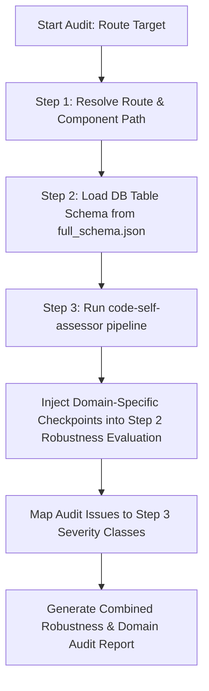

# App Route & View Auditor Skill

This specialized skill is designed to audit components and page controllers mapped in [AppRoutes.jsx](file:///e:/NAST/Dazzling/ERP%20System/dazzling-erp-admin/src/routes/AppRoutes.jsx). It focuses on ensuring they are fully functional, properly cached, synced with the database schema, compliant with the V2 Atomic UI guidelines, and architecturally robust.

This skill operates in close collaboration with the `code-self-assessor` skill to perform a multi-dimensional, domain-specific evaluation.

---

## 🔍 Audit Operations Checklist

When auditing a page or view component associated with a route in `AppRoutes.jsx`, perform the following six core audit operations:

### 1. Route Map & Component Resolution
- **Target**: Trace the path mapped in `AppRoutes.jsx` to the target page component.
- **Checks**:
  - Verify correct import paths.
  - Confirm the component renders under the appropriate layouts (e.g., `<AdminLayout />`) and uses proper guards (e.g., `<HydrationGuard />`).
  - Ensure URL parameter tokens (e.g., `:id`) are read and parsed safely.

### 2. Schema Synchronization (Truth-Source Alignment)
- **Target**: Cross-reference the component state, form inputs, table columns, and mutation payloads with [full_schema.json](file:///e:/NAST/Dazzling/ERP%20System/dazzling-erp-admin/src/Schema/full_schema.json).
- **Checks**:
  - Verify key spelling matches the DB definition precisely (e.g., `student_name` vs `fullName`, `batch_id` vs `itemId`).
  - Ensure data types are handled correctly (e.g., numbers parsed properly, empty text converted to `null` before submission, date strings formatted as ISO).
  - Verify that relationship IDs (foreign keys) are referenced and stored rather than literal labels or display names.

### 3. React Query & Cache Efficiency Audit
- **Target**: Analyze the component's data fetching, state management, and updates.
- **Checks**:
  - Verify standard custom query hooks are utilized instead of ad-hoc `useEffect` fetches or direct API calls.
  - Check for implementation of the **Cache-First Local Relation Resolver** pattern (inheriting list cache data for detail views to avoid immediate background refetches).
  - Check configuration parameters: `staleTime`, `initialData`, and `initialDataUpdatedAt` must be defined logically.
  - Confirm that mutations trigger exact cache invalidation (e.g., `queryKeys.entity.all`) on success.

### 4. V2 UI & Layout Compliance
- **Target**: Ensure styling and UI primitives align with the V2 slate theme guidelines.
- **Checks**:
  - Forms must use unified inputs: `FormField`, `TextInput`, `SelectInput`, `PhoneInput`, and `RadioGroup` from `src/components/ui/v2/`.
  - Layout must follow responsive grid rules (e.g., `max-w-2xl` for single-column and `max-w-5xl` for two-column layouts).
  - Accordion systems must present dynamic, live text summary pills (e.g., `Active • BRN001 • Competitive`) when collapsed, so the parameters remain visible.
  - Theme must match the dark-mode slate theme with glassmorphism and subtle animations.

### 5. Observability & Logging
- **Target**: Check for execution transparency.
- **Checks**:
  - Outgoing mutation payloads must be logged using `console.log('[Component] Submitting Request:', payload)`.
  - Incoming responses and failures must be explicitly logged (`console.log`, `console.error`) with context identifiers.

### 6. Micro-Optimizations & Lifecycle Safety
- **Target**: Prevent UI lag and runtime crashes.
- **Checks**:
  - Check for monolithic forms (>400 lines) that can be decomposed into smaller section-level sub-components.
  - Ensure proper dependency arrays for all `useMemo`, `useCallback`, and `useEffect` calls.
  - Prevent state updates on unmounted components during pending promises.

---

## 🤝 Collaboration with `code-self-assessor`

The `app-route-view-auditor` functions as a domain-specific context layer that feeds into the general `code-self-assessor` framework. 

### 1. Pipeline Integration Flow



### 2. Domain-Specific Severity Mapping for `code-self-assessor`

When scoring the codebase and identifying issues, classify findings using this severity protocol:

| Severity | Issue Type | Description / Trigger Scenario |
| :--- | :--- | :--- |
| 🔴 **Critical** | **API & Mutation Breaks** | Missing API registry mapping; lack of cache invalidation in mutators; password hashing vulnerabilities; unsafe storage of secrets. |
| 🟠 **High** | **Schema & Cache Failures** | Schema mismatches (e.g., camelCase in UI mapping to snake_case backend fields); state overwrites during background refetches; hardcoded dynamic form options. |
| 🟡 **Medium** | **UI & Maintainability Smells** | Monolithic form structure; missing live text summary pills on collapsed accordions; missing console observability for API payloads. |
| 🟢 **Low** | **Visual & UX Details** | Deviations from dark-mode glassmorphism; lack of breadcrumb navigation; minor grid layout misalignments. |

### 3. Execution Template

Use the following prompt format when delegating route audits to the `generalist` sub-agent:

```text
Perform a joint audit on the route '/admin/[route-name]' and component '[ComponentFile]' using 'app-route-view-auditor' and 'code-self-assessor'.

Audit Steps:
1. Locate route in AppRoutes.jsx and trace target component.
2. Resolve corresponding table schema from full_schema.json.
3. Assess the code across the 7 robustness axes, incorporating the specialized route checkpoints (Schema Sync, Cache-First, V2 UI, Observability).
4. Categorize issues using the Domain-Specific Severity Mapping.
5. Provide Root Cause Analysis and production-grade fixes.
6. Generate a final report.
```
