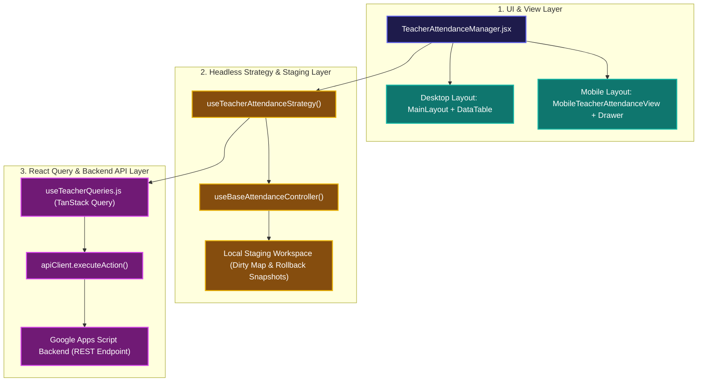
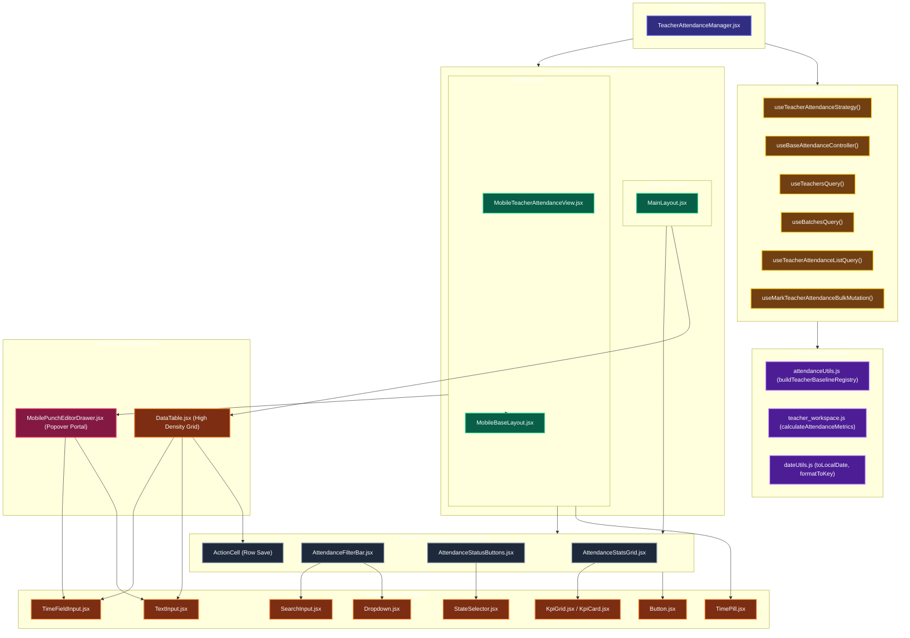
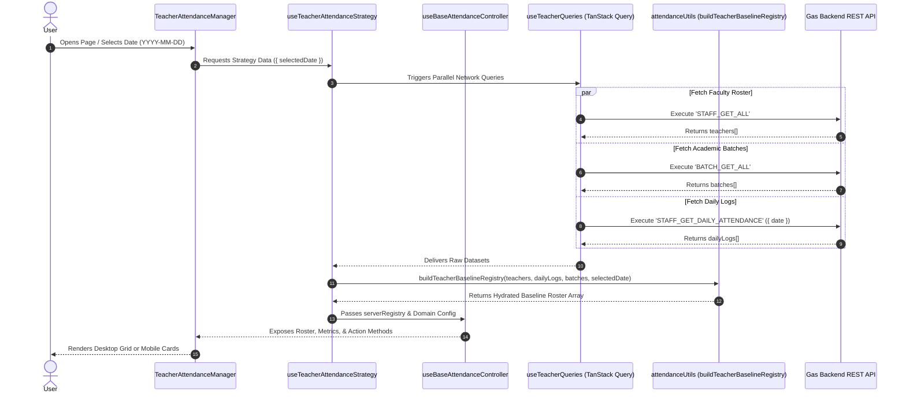
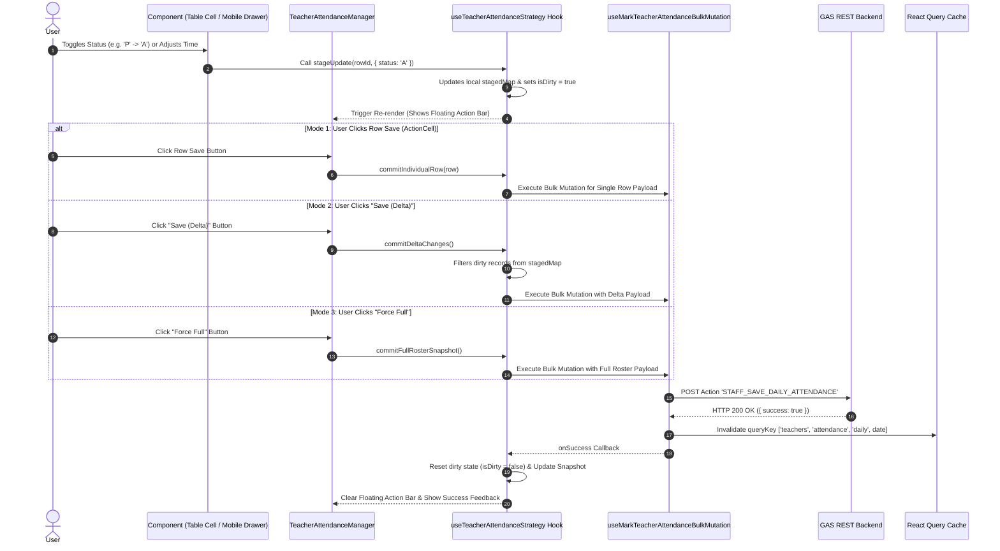

# Teacher Attendance Management System - System Architecture & Component Specification

This document serves as the authoritative, top-to-bottom technical architecture manual for the **Teacher Attendance Management System** in the Dazzling ERP Admin codebase.

---

## Section 0: Quick Guide & Executive Blueprint

### Executive Cheat Sheet

| Metric / Dimension | Specification |
| :--- | :--- |
| **Primary Route** | `/admin/teachers/attendance` (defined in [AppRoutes.jsx](file:///e:/NAST/Dazzling/ERP%20System/dazzling-erp-admin/src/routes/AppRoutes.jsx#L105)) |
| **Page Controller** | [TeacherAttendanceManager.jsx](file:///e:/NAST/Dazzling/ERP%20System/dazzling-erp-admin/src/features/teacher/components/TeacherAttendanceManager.jsx) |
| **Headless Strategy Hook** | `useTeacherAttendanceStrategy` ([useAttendance.js](file:///e:/NAST/Dazzling/ERP%20System/dazzling-erp-admin/src/features/attendance/hooks/useAttendance.js#L313)) |
| **Base Controller Hook** | `useBaseAttendanceController` ([useAttendance.js](file:///e:/NAST/Dazzling/ERP%20System/dazzling-erp-admin/src/features/attendance/hooks/useAttendance.js#L78)) |
| **State Modes** | Clean Baseline Snapshot vs. Dirty Staged Workspace (`isDirty`) |
| **Commit Modes** | 1. **Row Level**: `commitIndividualRow(row)`<br/>2. **Delta Commit**: `commitDeltaChanges()` (Dirty rows only)<br/>3. **Full Snapshot**: `commitFullRosterSnapshot()` (All active rows) |
| **GAS API Action Keys** | Read: `STAFF_GET_DAILY_ATTENDANCE` (`ATTENDANCE.TEACHER_QUERY`) <br/> Write: `STAFF_SAVE_DAILY_ATTENDANCE` (`ATTENDANCE.TEACHER_MARK_BULK`) |
| **React Query Cache Key** | `queryKeys.teacher.attendanceDaily(date, 'all')` |
| **Security Lock Rule** | Past dates locked (`isPastLocalDate(date)`) for non-superadmin users |

### Compact Architectural Overview Diagram



---

## Section 1: Executive Architecture Overview

The Teacher Attendance Management module is engineered around five foundational architectural tenets:

1. **Headless Strategy Pattern (`useTeacherAttendanceStrategy`)**:
   - UI views are completely decoupled from state calculation, fetching, and persistence logic.
   - The strategy hook delegates common state tracking to `useBaseAttendanceController` while specializing data baseline assembly for teachers using `buildTeacherBaselineRegistry`.
   - **Outer-Join Baseline Mechanics**:
     - Fetches active faculty list (`teachers`), academic cohorts (`batches`), and existing attendance logs for the selected date (`dailyLogs`).
     - Performs an outer-join matching `teachers.id` against `dailyLogs.teacher_id`.
     - **Unmarked Record Detection (NR Badge)**: If no log exists for a teacher on the target date, flags `isUnmarkedCurrentDate = true` (if today) or `isUnmarkedPastDate = true` (if past date) and assigns status `'NR'`.
     - **Default Fallback Timestamps**: Auto-populates entry time `08:00` and exit time `16:00` for unmarked faculty, ensuring complete row objects are supplied to UI form elements without undefined crashes.

2. **In-Memory Staging Workspace with Rollback Snapshots**:
   - User actions (`status` change, punch-in/out edits, remarks) modify an in-memory draft map (`stagedRecords`) instantly.
   - **Micro-Lag Elimination**: Zero network requests occur during local edits. The UI updates at 60 FPS.
   - **Snapshot Deep-Cloning**: Upon baseline data load, the hook performs a strict deep-copy snapshot (`JSON.parse(JSON.stringify(initialMap))`). This allows one-click draft resetting via `clearWorkspaceDrafts` without re-fetching network data.
   - **Dirty State Determination (`isDirty`)**: Compares every record in `stagedRecords` against `initialSnapshot`. If any status, entry time, exit time, or remarks field differs, `isDirty` turns `true`, triggering the sticky bottom action drawer.

3. **Multi-Tiered Granular Persistence Strategy**:
   - **Row-Level Save (`commitIndividualRow`)**: Targeted persistence for a single teacher record via `ActionCell`. Passes a single-item array payload to the mutation.
   - **Delta Commit (`commitDeltaChanges`)**: Filters `stagedRecords` to collect only rows where fields differ from `initialSnapshot`. Transmits *only* dirty records over HTTP, reducing network payload size by up to 90% in large rosters.
   - **Force Full Snapshot (`commitFullRosterSnapshot`)**: Submits the complete roster array regardless of dirty state, allowing superadmins to enforce total backend state reconciliation.

4. **Responsive Dual-Engine Presentation & Render Isolation**:
   - **Desktop Grid**: Displays high-density data matrix via `DataTable`, custom `TimeFieldInput`, and sticky floating action footer.
   - **Mobile Experience**: Built on `MobileBaseLayout` with low-density cards, `TimePill` indicators, and popover portals (`MobilePunchEditorDrawer`).
   - **Render Isolation**: To prevent input keypress latency when typing remarks or modifying punch times across hundreds of rows, `ActionCell` is memoized with `React.memo` and mobile punch adjustments are isolated inside `MobilePunchEditorDrawer` portal popovers.

5. **Timezone-Safe Date Processing & Security Lock System**:
   - Dates are formatted strictly as `YYYY-MM-DD` strings via `dateUtils.js` (`toLocalDate`, `formatToKey`), preventing standard `Date.toISOString()` timezone boundary drift (where UTC shifts midnight dates to the previous day).
   - Non-superadmin users are restricted from editing historical past registers (`isPastLocalDate(selectedDate)`), disabling status buttons, inputs, and save actions automatically.

---

## Section 2: Top-to-Bottom Component Architecture & Hierarchy

The flowchart below maps every file, component, hook, and utility in the system hierarchy:



---

## Section 3: Data Flow & State Lifecycle

### 3.1 Data Ingestion & Baseline Assembly Lifecycle

When the user selects a date, raw asynchronous streams are combined and normalized into a unified baseline registry:



### 3.2 In-Memory Staging & Commit Flow

User changes stay staged locally until explicitly committed:



---

## Section 4: Component-by-Component Technical Specifications

### 4.1 Route & Controller Layer

#### 1. [TeacherAttendanceManager.jsx](file:///e:/NAST/Dazzling/ERP%20System/dazzling-erp-admin/src/features/teacher/components/TeacherAttendanceManager.jsx)
- **Path**: `src/features/teacher/components/TeacherAttendanceManager.jsx`
- **Role**: Master Page Controller and Layout Orchestrator.
- **State Managed**:
  - `selectedDate`: String (`YYYY-MM-DD`). Default: current local date.
  - `selectedBatchId`: String (`'all'` or specific batch ID).
  - `statusFilter`: String (`'ALL'`, `'P'`, `'A'`, `'L'`).
  - `searchQuery`: String (filter text).
  - `activeMobileEditingRowId`: String (ID of row open in mobile popover drawer).
- **Consumes**:
  - `useTeacherAttendanceStrategy({ selectedDate })`
  - `useIsMobile(768)`
- **Key Callbacks**:
  - `actions.handleStatusChange(id, status)`
  - `actions.handleTimeChange(id, field, val)`
  - `actions.handleRemarksChange(id, val)`
  - `actions.handleMarkAllPresent()`
  - `actions.handleReset()`
  - `commitDeltaChanges()`, `commitFullRosterSnapshot()`

---

### 4.2 Presentation Shells Layer

#### 2. [MainLayout.jsx](file:///e:/NAST/Dazzling/ERP%20System/dazzling-erp-admin/src/components/layout/MainLayout.jsx)
- **Path**: `src/components/layout/MainLayout.jsx`
- **Role**: Desktop application layout frame containing global sidebar, header, body scroll container, and sticky bottom footer tray slot.

#### 3. [MobileTeacherAttendanceView.jsx](file:///e:/NAST/Dazzling/ERP%20System/dazzling-erp-admin/src/features/teacher/components/attendance/MobileTeacherAttendanceView.jsx)
- **Path**: `src/features/teacher/components/attendance/MobileTeacherAttendanceView.jsx`
- **Role**: Mobile viewport rendering root.
- **Props**:
  - `filteredTeachers`: Array of teacher objects.
  - `isLoading`: Boolean.
  - `isEditingDisabled`: Boolean.
  - `actions`: Object containing state modification functions.
  - `metrics`: Calculated KPI stats object.
  - `filters`: React element node (`AttendanceFilterBar`).
  - `isDirty`: Boolean.

---

### 4.3 Feature Presentation Sub-Components

#### 4. [AttendanceStatsGrid.jsx](file:///e:/NAST/Dazzling/ERP%20System/dazzling-erp-admin/src/features/teacher/components/attendance/AttendanceStatsGrid.jsx)
- **Path**: `src/features/teacher/components/attendance/AttendanceStatsGrid.jsx`
- **Role**: Real-time operational metric dashboard.
- **Props**: `metrics` (`{ total, present, absent, late, unrecorded }`), `isMobile` (Boolean).
- **Desktop Rendering**: 5-column `<KpiGrid>` using `<KpiCard size="md" isCount={true} />`.
- **Mobile Rendering**: Compact horizontal flex wrap container with color-coded status pills.

#### 5. [AttendanceFilterBar.jsx](file:///e:/NAST/Dazzling/ERP%20System/dazzling-erp-admin/src/features/teacher/components/attendance/AttendanceFilterBar.jsx)
- **Path**: `src/features/teacher/components/attendance/AttendanceFilterBar.jsx`
- **Role**: Filtering toolbar.
- **Child Primitives**:
  - `SearchInput` (Text query filter)
  - Status Pill Buttons (`ALL`, `P`, `A`, `L`)
  - `Dropdown` (Batch selection with `LowDensityCard` items)
  - HTML Date Picker (`type="date"`)

#### 6. [AttendanceStatusButtons.jsx](file:///e:/NAST/Dazzling/ERP%20System/dazzling-erp-admin/src/features/teacher/components/attendance/AttendanceStatusButtons.jsx)
- **Path**: `src/features/teacher/components/attendance/AttendanceStatusButtons.jsx`
- **Role**: Presentational wrapper for status mutation buttons.
- **Child Component**: Wraps `<StateSelector />` configured with `ATTENDANCE_CONFIG`:
  - `P` (Present): Emerald theme
  - `A` (Absent): Rose theme
  - `L` (Late): Amber theme

#### 7. ActionCell Component (Memoized)
- **Path**: Internal to `TeacherAttendanceManager.jsx` (Lines 25–46).
- **Role**: Row-level inline save trigger.
- **Behavior**: Renders a `<Button size="xs" />`. When row is dirty, highlights in Indigo and triggers `commitIndividualRow(row)`.

---

### 4.4 Shared Domain Components & Portals

#### 8. [MobilePunchEditorDrawer.jsx](file:///e:/NAST/Dazzling/ERP%20System/dazzling-erp-admin/src/components/domain/MobilePunchEditorDrawer.jsx)
- **Path**: `src/components/domain/MobilePunchEditorDrawer.jsx`
- **Role**: Mobile bottom-sheet popover portal.
- **Props**: `row` (active row object), `isEditingDisabled`, `onTimeChange`, `onRemarksChange`, `onClose`.
- **Purpose**: Prevents re-render lag across long mobile card lists by isolating time and remarks inputs inside an overlay drawer portal.

---

### 4.5 Atomic V2 UI Primitives

| Component | File Location | Purpose & Styling Rule |
| :--- | :--- | :--- |
| **`DataTable`** | [DataTable.jsx](file:///e:/NAST/Dazzling/ERP%20System/dazzling-erp-admin/src/components/ui/DataTable.jsx) | High-density data grid with pagination, loading skeletons, and custom cell renderers. |
| **`KpiCard`** | [KpiCard.jsx](file:///e:/NAST/Dazzling/ERP%20System/dazzling-erp-admin/src/components/ui/v2/KpiCard.jsx) | Standardized metric tile supporting `isCount={true}` for integer counts. |
| **`StateSelector`** | [StateSelector.jsx](file:///e:/NAST/Dazzling/ERP%20System/dazzling-erp-admin/src/components/ui/v2/StateSelector.jsx) | Segmented pill button group for clean toggle actions. |
| **`TimeFieldInput`** | [TimeFieldInput.jsx](file:///e:/NAST/Dazzling/ERP%20System/dazzling-erp-admin/src/features/batch/components/FormField/TimeFieldInput.jsx) | 12-hour AM/PM time entry box with clock icon. |
| **`TextInput`** | [TextInput.jsx](file:///e:/NAST/Dazzling/ERP%20System/dazzling-erp-admin/src/components/ui/v2/TextInput.jsx) | Standardized single-line text input for remarks. |
| **`TimePill`** | [TimePill.jsx](file:///e:/NAST/Dazzling/ERP%20System/dazzling-erp-admin/src/components/ui/v2/TimePill.jsx) | Compact badge displaying check-in/check-out timestamps on mobile cards. |
| **`Button`** | [Button.jsx](file:///e:/NAST/Dazzling/ERP%20System/dazzling-erp-admin/src/components/ui/v2/Button.jsx) | Polymorphic design system button (`contained`, `outlined`, `text`, `success`, `danger`). |
| **`Dropdown`** | [SelectDropdown.jsx](file:///e:/NAST/Dazzling/ERP%20System/dazzling-erp-admin/src/components/ui/v2/SelectDropdown.jsx) | Compound dropdown list with integrated search. |

---

### 4.6 Headless State Hooks & Strategy Layer

#### 9. [useAttendance.js](file:///e:/NAST/Dazzling/ERP%20System/dazzling-erp-admin/src/features/attendance/hooks/useAttendance.js)

`useAttendance.js` is the domain-agnostic headless state module serving as the core engine across all attendance tracking interfaces (Student Batch Attendance, Daily Faculty Attendance, and Single Teacher Profile History).

---

##### A. Abstract Core Controller: `useBaseAttendanceController`
- **JSDoc Signature**:
  ```javascript
  /**
   * Abstract core state orchestrator. Manages local draft deltas, filters,
   * metrics compilation, and transactional dispatch lifecycles.
   * @param {Object} config
   * @param {Array} [config.serverRegistry=[]] - Raw baseline data array from network queries
   * @param {Object} config.mutation - React Query mutation hook instance
   * @param {Object} config.domainConfig - Domain specification contract (from ATTENDANCE_DOMAINS)
   * @param {Object} config.filterState - { selectedDate, selectedBatchId, statusFilter, searchQuery }
   * @param {Object} [config.options={}] - Custom event callbacks ({ onSuccess, onError })
   * @returns {Object} Staging state, calculated metrics, and operational commit methods
   */
  export function useBaseAttendanceController({
      serverRegistry = [],
      mutation,
      domainConfig,
      filterState,
      options = {}
  })
  ```

- **Internal State Architecture**:
  1. **`draftDeltas` Ledger**: Local state object `{ [entityId]: { status, entry_time, exit_time, remarks } }` tracking inline edits at $O(1)$ complexity.
  2. **`saveStatus`**: Tracks network dispatch lifecycle (`'saving'` | `'success'` | `'error'` | `null`).

- **4-Stage Reactive Pipeline**:
  ```
  serverRegistry + draftDeltas
             │
             ▼ (transformServerToClientRoster)
      rawClientRoster
             │
             ▼ (filterClientRoster by batch, status, search)
       finalRoster
             │
             ▼ (calculateAttendanceMetrics)
        metrics & isDirty (Object.keys(draftDeltas).length > 0)
  ```

- **Staging & Automatic Reversion Algorithm (`stageUpdate`)**:
  - Accepts `id` and `updatedFields`.
  - Merges new inputs into existing draft: `mergedFields = { ...prev[id], ...updatedFields }`.
  - **Automatic Reversion Check**: Compares `mergedFields` against `serverMatch` from `serverRegistry`.
    - If `status === serverMatch.status`, `entry_time === serverMatch.entry_time`, `exit_time === serverMatch.exit_time`, and `remarks === serverMatch.remarks`, the hook **evicts** `[id]` from `draftDeltas` completely!
    - This automatically resets `isDirty` to `false` when a user toggles a status back to its original baseline value, preventing redundant network saves.

- **Three-Tier Mutation Commit Handlers**:
  1. **`commitIndividualRow(row)`**:
     - Compiles an `'individual'` commit mode payload targeting a single teacher record.
     - Calls `executeMutationCommit(payload)`. Upon success, deletes only `[row.id]` from `draftDeltas`.
  2. **`commitDeltaChanges()`**:
     - Asserts time format validity via `validateTimeFormat(timeString)` (`HH:MM` format).
     - Compiles a `'delta'` commit payload containing *only* dirty rows in `draftDeltas`.
     - Executes `mutation.mutateAsync`, triggers `queryClient.invalidateQueries` using domain cache keys, and clears `draftDeltas`.
  3. **`commitFullRosterSnapshot()`**:
     - Compiles an `'all'` commit payload containing the entire `finalRoster` array to force full state reconciliation.

---

##### B. Teacher Strategy Hook: `useTeacherAttendanceStrategy`
- **JSDoc Signature**:
  ```javascript
  /**
   * Teacher Strategy: Unconditionally invokes Daily Teacher queries, merges them to build baseline,
   * and passes them down to the abstract controller hook.
   * @param {Object} filterState - { selectedDate: string }
   * @param {Object} [options={}] - Custom options
   * @returns {Object} Hydrated controller state & action handlers
   */
  export function useTeacherAttendanceStrategy(filterState, options = {})
  ```
- **Execution Workflow**:
  1. Unconditionally invokes React Query hooks: `useTeachersQuery`, `useBatchesQuery`, and `useTeacherAttendanceListQuery(selectedDate)`.
  2. Invokes `useMarkTeacherAttendanceBulkMutation()`.
  3. Computes `serverRegistry` via `buildTeacherBaselineRegistry(teachers, dailyLogs, batches, selectedDate)`.
  4. Delegates to `useBaseAttendanceController` with domain configuration `ATTENDANCE_DOMAINS.TEACHERS`.
  5. Combines loading states: `isLoading = isLoadingTeachers || isLoadingBatches || isLoadingLogs || mutation.isPending`.

---

##### C. Single Teacher Profile Strategy: `useSingleTeacherAttendance`
- **JSDoc Signature**:
  ```javascript
  export function useSingleTeacherAttendance(teacherId, filterState, options = {})
  ```
- **Execution Workflow**:
  1. Calls `useTeacherAttendanceQuery(teacherId)` to load historical attendance logs for a single faculty member.
  2. Calls `useUpdateTeacherAttendanceMutation()`.
  3. Binds `ATTENDANCE_DOMAINS.SINGLE_TEACHER` domain rules to manage individual teacher profile calendars and time punches.

---

### 4.7 React Query Data Layer

#### 11. [useTeacherQueries.js](file:///e:/NAST/Dazzling/ERP%20System/dazzling-erp-admin/src/features/teacher/hooks/useTeacherQueries.js)
- **`useTeachersQuery()`**: Fetches all faculty master records. Cache Key: `queryKeys.teacher.all`.
- **`useTeacherAttendanceListQuery(date)`**:
  - Fetches daily logs for a given date using action `API_REGISTRY.ATTENDANCE.TEACHER_QUERY`.
  - Cache Key: `queryKeys.teacher.attendanceDaily(date, 'all')`.
  - Converts server ISO timestamps to localized `YYYY-MM-DD` strings.
- **`useMarkTeacherAttendanceBulkMutation()`**:
  - Sends bulk update payload using action `API_REGISTRY.ATTENDANCE.TEACHER_MARK_BULK`.
  - On success: Invalidate cache for `queryKeys.teacher.attendanceDaily(attendance_date)`.

---

### 4.8 Pure Domain Utilities

#### 12. [attendanceUtils.js](file:///e:/NAST/Dazzling/ERP%20System/dazzling-erp-admin/src/features/attendance/utils/attendanceUtils.js)
- **Domain Contract Definition**:
  ```javascript
  export const ATTENDANCE_DOMAINS = {
    TEACHERS: {
      domainKey: 'TEACHERS',
      entityType: 'teacher',
      queryAction: 'STAFF_GET_DAILY_ATTENDANCE',
      mutationAction: 'STAFF_SAVE_DAILY_ATTENDANCE',
      hasTimeCapture: true,
      defaultEntryTime: '08:00',
      defaultExitTime: '16:00',
      // ... transformPayload & cacheKey resolvers
    }
  };
  ```
- **Pure Function Blueprint: `buildTeacherBaselineRegistry`**:
  ```javascript
  /**
   * Pure baseline assembly function merging faculty master records with daily log entries.
   * @param {Array} teachers - Master faculty roster
   * @param {Array} dailyLogs - Existing attendance logs for the target date
   * @param {Array} batches - Academic cohorts lookup list
   * @param {string} selectedDate - Selected date (YYYY-MM-DD)
   * @returns {Array} Hydrated baseline records array
   */
  export function buildTeacherBaselineRegistry(teachers, dailyLogs, batches, selectedDate)
  ```
  - **Step 1 (O(1) Map Creation)**: Maps `dailyLogs` by `teacher_id` into a lookup hash map.
  - **Step 2 (Outer Join & Hydration)**: Iterates over `teachers`. If a log exists, copies `status`, `entry_time`, `exit_time`, `remarks`.
  - **Step 3 (NR Flag Calculation)**: If no log exists:
    - Calculates if target date is in the past via `isPastLocalDate(selectedDate)`.
    - Flags `isUnmarkedPastDate = true` or `isUnmarkedCurrentDate = true`.
    - Sets default status to `'NR'` and time fallbacks (`'08:00'`, `'16:00'`).

#### 13. [teacher_workspace.js](file:///e:/NAST/Dazzling/ERP%20System/dazzling-erp-admin/src/features/teacher/utils/teacher_workspace.js)
- **`calculateAttendanceMetrics(records)`**:
  - Evaluates active array elements:
    $$\text{attendanceRate} = \left\lfloor \frac{\text{present} + \text{late}}{\text{total} - \text{unrecorded}} \times 100 \right\rfloor$$
  - Returns `{ total, present, absent, late, unrecorded, attendanceRate }`.

---

## Section 5: API & Database Contract Mapping

### 5.1 Backend REST Action Specifications

Communication with the Google Apps Script backend executes via `apiClient.executeAction`:

#### 1. Read Action Specification
- **Action Key**: `API_REGISTRY.ATTENDANCE.TEACHER_QUERY` $\rightarrow$ `'STAFF_GET_DAILY_ATTENDANCE'`
- **HTTP Method**: `POST` (GAS Web App Dispatcher)
- **Request Payload Schema**:
  ```json
  {
    "action": "STAFF_GET_DAILY_ATTENDANCE",
    "payload": {
      "where": {
        "attendance_date": "2026-07-28"
      }
    }
  }
  ```
- **Response Envelope**:
  ```json
  {
    "success": true,
    "data": [
      {
        "id": "ATT_TCH_101_20260728",
        "teacher_id": "TCH-101",
        "batch_id": "BATCH-11A",
        "attendance_date": "2026-07-28",
        "status": "P",
        "entry_time": "08:05",
        "exit_time": "16:00",
        "remarks": "On duty"
      }
    ]
  }
  ```

#### 2. Write Mutation Action Specification
- **Action Key**: `API_REGISTRY.ATTENDANCE.TEACHER_MARK_BULK` $\rightarrow$ `'STAFF_SAVE_DAILY_ATTENDANCE'`
- **HTTP Method**: `POST`
- **Request Payload Schema**:
  ```json
  {
    "action": "STAFF_SAVE_DAILY_ATTENDANCE",
    "payload": {
      "attendance_date": "2026-07-28",
      "commit_mode": "delta",
      "records": [
        {
          "teacher_id": "TCH-101",
          "batch_id": "BATCH-11A",
          "status": "P",
          "entry_time": "08:05",
          "exit_time": "16:00",
          "remarks": "On duty"
        }
      ]
    }
  }
  ```
- **Response Envelope**:
  ```json
  {
    "success": true,
    "message": "Teacher attendance recorded successfully",
    "updated_count": 1
  }
  ```

---

## Document Verification Record

- **Document Version**: 1.0.0
- **Verification Status**: Verified against live codebase
- **Primary References**:
  - `src/features/teacher/components/TeacherAttendanceManager.jsx`
  - `src/features/attendance/hooks/useAttendance.js`
  - `src/features/attendance/utils/attendanceUtils.js`
  - `src/features/teacher/hooks/useTeacherQueries.js`
